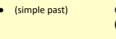

# Unit 2Writing An Annotated Bibliography

## Part 1 Connecting With The Theme

Watch the video titled 'What is a gig economy?'(00:00-05:17) **by TED-Ed**. https://www.youtube.com/watch?v=OXT8xdqcAoU

## Activity 1 - Post-Viewing Discussion

1. Briefly describe the origin of the word "freelancer". 2. According to the video, what "hidden costs" are involved with being a freelancer?

3. Do you know anything about working for food delivery platforms like foodpanda or Deliveroo?

4. In general, does the platform economy (e.g., Taobao, Uber, foodpanda) positively impact society?

5. Would you prefer to work for a company or be self-employed?

## █║ Previewing And Skimming A Text

Previewing and skimming help you get an overall idea of the text. These simple skills can save you a lot of time because previewing a text allows you to quickly determine whether or not the reading material meets your purpose, while skimming allows you to pick up the main ideas without reading the entire passage. 

In daily life, you often apply the skill of previewing. For example, before you read a new post shared on Instagram, you may first check how many 'Likes' and other reactions the post has attracted, as well as the picture or video that comes with the post. At university, you are often required to read a number of lengthy book chapters, journal articles or other kinds of readings that are relevant to a particular course. It is, therefore, very important that you develop active reading strategies so that you can locate the most important information **quickly** and **effectively**. 

## Reading Skill Previewing And Skimming A Text

Previewing and skimming a text require you to quickly go over the passage without reading every 

main point of the paragraph)

## 

Download the journal article titled 'Applying importance-satisfaction model to evaluate customer satisfaction: An empirical study of foodpanda' by Liu et al. (2021) in Sustainability, 13(19) via this link:
https://library.hkbu.edu.hk/record/?ID=TN_cdi_doaj_primary_oai_doaj_org_article_dd9ac71f015348 01916588739640a405&T=PC

Apply the skills of previewing and skimming a text and answer the following questions as you read the article by Liu et al. (2021). You should spend a maximum of 5 minutes on this task. Discuss your answers with a partner.

1. What is this journal article about?

2.

What is the purpose of this journal article?

4. Which three aspects of foodpanda service fell into the 'Careless' category of the total I-S Model according to this research?

5. According to the researchers, what are the limitations of this research?

## █║ Annotating And Notetaking Reading Skill Annotating A Text And Notetaking

Items that you can note down while reading a text:
Your Thoughts Write your own feelings or reactions to create a connection between your mind and the issues raised in the text. This information will be particularly useful if you have to write a review or critique of the passage later. Your Questions about the Text Note down points that you wonder if the writer will elaborate or explain later in the passage. For example:
- 'Why is this particular data mentioned?' (question the significance/relevance)
- 'Why does the writer say X while passing over Y which is also related?' (question the validity)
New Vocabulary You can sometimes figure out the meaning of a new word from its context. If so, write down the information in the margin. If not, highlight the word (especially if it appears multiple times in the text) and consult a dictionary later.

## Developing Your Annotation Codes

It is useful to invent your own set of codes, abbreviations, or shorthand symbols for annotating a text. This notetaking technique, as practised earlier, is arguably even more useful when critically reading a text. 

Examples of annotation codes:

TS Thesis statement Exp Explain/Explanation

? What does it mean? Ev Evidence

~ Similar to MP Main point

Check Check a dictionary later Def Definition 

Arg Argument R'ed 'A' is related to 'B'

## An Example Of An Annotated Text

| Meaning?                                                | The stay-at-home economy because of the COVID-19 pandemic has driven  many more shoppers online, and delivery services soon became a daily             |                                                                       |
|---------------------------------------------------------|--------------------------------------------------------------------------------------------------------------------------------------------------------|-----------------------------------------------------------------------|
| COVID-19 →  ↑ Online shopping  ↑ Delivery Ss            | necessity. For the catering industry, providing an online food delivery  service not only saved costs associated with a store and on-site service, but |                                                                       |
| e.g., Catering industry                                 | it increased sales during the pandemic (Op View Social Watch, 2020).                                                                                   |                                                                       |
| -                                                       | Saved $                                                                                                                                                |                                                                       |
| -                                                       | ↑ sales                                                                                                                                                | Therefore, food delivery platforms serve both catering businesses and |
| -                                                       | 😀 businesses and                                                                                                                                      | consumers in this on-demand economy (Tech News, 2020).                |
| consumers                                               |                                                                                                                                                        |                                                                       |
| Qs while reading: - challenges? - business sustainable? |                                                                                                                                                        |                                                                       |

The following paragraph is taken from an article titled 'Applying importance**-satisfaction model to** 
evaluate customer satisfaction: An empirical study of f**oodpanda'** by Liu at al. (2021) in the academic journal *Sustainability*. Pay attention to the use of annotations (i.e., brief notes) in the margin.

## Activity 3 - Annotating A Text And Notetaking

Now read and annotate two other paragraphs taken from the article by Liu et al. (2021). Compare your annotations with a partner.

| Taiwanese vendors and restaurants are not tech-savvy, and payments  are either in cash or by credit card, which made Foodpanda struggle for  quite a while. However, repeated communication and explanation  made a lot of vendors realise that online customers can also increase  sales and generate new customers. Foodpanda has successfully signed  contracts with more than 7000 vendors or restaurants. According to a  January 2019 announcement, the number of daily orders has increased  1000 times since the beginning, making Foodpanda first in the delivery   |
|------------------------------------------------------------------------------------------------------------------------------------------------------------------------------------------------------------------------------------------------------------------------------------------------------------------------------------------------------------------------------------------------------------------------------------------------------------------------------------------------------------------------------------------------------------------------------|

| platform industry and giving it a 55% market share (Tech News, 2020). Finally, this study can be used to evaluate the factors affecting  customer satisfaction and loyalty. The online food delivery service  developer needs to provide believable, detailed, and structured  information in an appropriate format so that customers have less  hesitation in using it (Prasetyo et al., 2021). Social media have also  gradually become one of the main marketing tools not only for product  quality but also for service quality in the Business to Customer (B2C) ecommerce market. Customers experience each element of the service  from ordering to the delivery staff standing on the doorsteps long  before they consume the product. A customer's emotional reaction to  the intangible service quality affects satisfaction and motivation for a  repurchase (Wang et al., 2015).   |
|---|

## █║ Identifying The Thesis Statement, Main Ideas And Supporting Details

The thesis statement presents the **central idea** in a text. It is like the backbone which **links up all the** 
paragraphs, arguments, examples and evidence in an essay. It also presents the road map of a passage for the readers and lets them know what to expect from the rest of the text. Sometimes, the thesis may be implicitly (i.e., indirectly) stated in a text. This kind of writing is more challenging because readers will have to find the central claim which subtly connects all the main arguments in the text.

## Reading Skill Identifying The Thesis Statement

Finding the thesis statement is an important part of reading comprehension. To locate the thesis, you can start by following these steps.

## Step 1: Ask Questions While Previewing The Passage

The **abstract** and **section headings** in 

academic writings such as journal articles and book chapters will be a great place to start because the central idea of the text is often succinctly stated there. Sometimes, the thesis can be partly stated in the title of an article. While you are previewing the text, ask yourself, **'What is the article** 
about?' or **'What does the writer want to** argue/show in the article?'
For example:
From the title of the journal article by Liu et al. (2021) "Applying Importance**-Satisfaction** 

 Model to evaluate customer satisfaction: An empirical study of f**oodpanda"**, it can be predicted that the thesis relates to customer satisfaction regarding *foodpanda.* 

## Step 2: Read The Introductory And Concluding Paragraphs

In many academic articles, the thesis statement is placed at the end of the introductory paragraph and is often re-stated in the conclusion, in which the main aspects discussed in the article are summarised.

For example: 
The thesis statement of the journal article by Liu et al. (2021) is placed at the end of the introduction: 

## Step 3: Look For Word Clues

Particularly in academic texts, the expressions below are often used to signal the location of the thesis 

statement:

aims to discuss/examine … In essence, … is primarily concerned about … The purpose of this article… focuses on … It is argued/suggested that …

## Reading Skill Identifying Main Ideas (Topic Sentences)

The main idea of a paragraph, or the topic sentence, **summarises what the writer will explain in the** 
paragraph. It is the glue that holds all the supporting details in the paragraph together, and it should represent an idea which is subordinate to **the thesis statement**. 

Main ideas are often stated directly, or explicitly, in the text, although sometimes they are implied. 

- Get the gist of the reading text quickly;
- Notice connections between the ideas in the text and the real world;
- Write an effective summary for your assignments.

## How To Locate The Main Ideas?

Strategy: Ask questions while looking in the usual spots You should keep asking, 'What is the paragraph/section about?' or **'What is the writer telling me** specifically **about the subject?'** while reading the whole paragraph. To effectively convey their point, writers usually state the main idea explicitly at the beginning of a paragraph, although it could also be found in the middle or at the end of a paragraph.

## For Example:

The topic sentence of the first paragraph in the 'Discussion' section of the journal article by Liu at al. (2021) identifies the focus of discussion of the section about what was learned from the research results regarding the demographic variables examined:

## 4.3. Discussion

This study imported the questionnaire results into the I–S Model taking demographic variables into account. From the gender analysis, it was found that women paid more attention to food price and the convenience of using of the app than men did. Men cared more about the delivery price, while neither cared about Foodpanda's popularity. From the marital status analysis, unmarried customers paid more attention to food price, while the married paid more attention to convenience. The married had no time to study the app so they paid more attention to the convenience of its use.

From the age analysis, people aged 21–30 cared more about price. Young people under the age of 20 were more able to operate mobile software and were more satisfied with the operation of the app. People aged 21–30 cared about the ease of operation of the app and were even satisfied with the promotional activities of Foodpanda, while those over 31 years did not care much about them.

From the occupation analysis, students and service-industry workers had limited leisure time, so they were very concerned about delivery speed and very satisfied with the food quality. This study found students have fewer sources of money, so they bought cheaper things. In contrast, service industry workers have more income, so they were more receptive to higher prices. Both students and the service industry were very satisfied with the app and promotional activities.

From the educational background analysis, those with less than a high school education said that the delivery speed, food price, app convenience and delivery price did not meet their expectations and hoped that Foodpanda had room for improvement. On the other hand, college students were very satisfied with these four demands, so it was found that the experiences of high school and college students were vastly different. From the total I–S Model analysis, people were most dissatisfied with food prices, while there are more high-priced food that low-priced food. Therefore, prices were still unacceptable to students and young people, while most people were quite satisfied with the other aspects.

## Activity 4 - Identifying Main Ideas

Read the following two paragraphs taken from Le Brocq et al. **(2023). Identify and highlight the main** ideas of each paragraph. 

Le Brocq, S., Hughes, E., & Donnelly, R. (2023). Sharing in the gig economy: From equitable work relations to exploitative HRM. *Personnel Review*, 52(3), 454-469. https://livrepository.liverpool.ac.uk/3166592/1/PR%20accepted.pdf The following paragraph is taken from Le Brocq et al. (2023)'s article:
Some platforms do offer greater transparency and enable greater peer-to-peer sharing due to their more collaborative business models. For example, BlaBlaCar permits individuals who are traveling to a particular destination to advertise a free seat in their car (Aversa et al., 2021). The platform recommends a fee to charge riders. Drivers have some discretion to advertise a different fee, but the fee must be classed by the platform as not-for-profit, thus only covering the cost of the journey. For prebooked seats, riders must pay an additional service fee, enabling BlaBlaCar to generate unearned income. Other more collaborative gig enterprises include freelancer-run Loconomics, which provides a range of different services from acupuncture to bookkeeping, and Up and Go, which connects customers to professional cleaner cooperatives (Meijernik & Keegan, 2019). The following paragraph is adapted from Le Brocq et al. (2023)'s article: Hidden inequalities within the gig economy can manifest in various ways. For example, Moisander et al. (2018) studied CloudNine, a gig firm where business partners sell products and try to recruit their own distributors. The firm's promotional materials state, "if you're willing to put in the time, effort, and hard work, the CloudNine experience can lead to more financial opportunity, flexibility, and freedom to determine your own path" (Moisander et al., 2018, p. 386). However, the researchers found that most of the gig workers they sampled did not break even, because they incurred additional costs, for instance, travelling to recruitment talks and purchasing business support materials. The study found that many business partners left within the first year due to the quantitative contributive injustices they perceived, and the HR promises they perceived to be unmet. 

## Reading Skill Locating Supporting Details

Every well-constructed paragraph should present one main idea (or topic sentence) and relevant support for that idea. Supporting information serves to develop and validate the main point, and generally comprises facts, observations, research findings, statistics or data, **anecdotes** (short stories about a person), **quotes**, and/or **examples**.

As mentioned, **the main idea may be implicitly stated** in some difficult readings. Therefore, being able to identify supporting details is important because by examining the common theme shared among all the supporting details and then working backwards, you can figure out the main idea. Facts, examples, data/statistics, and research findings are types of support often used in academic writing. In the following examples, the main idea (topic sentence) is highlighted. 

| a) Facts                                                                                                                                                                   | This paragraph is taken from the article by Wohn et al. (2019), p.100: The main difference between traditional patronage and digital patronage is  that the former relies on a small number of wealthy individuals while the  latter relies on a large number of individuals who contribute a small  amount of money. To a certain extent, digital patronage could be seen as a  form of crowdfunding, however, most crowdfunding research to date has  only examined the funding of isolated projects, or campaigns.  Crowdfunding projects tend to be either charitable in nature or a means of  early investment in receiving a potential artifact or product. Supporters of  digital patronage, however, may or may not receive a tangible product in  return, and their support is continuous, which begs understanding of what  contributes to that loyalty.   |
|----------------------------------------------------------------------------------------------------------------------------------------------------------------------------|----------------------------------------------------------------------------------------------------------------------------------------------------------------------------------------------------------------------------------------------------------------------------------------------------------------------------------------------------------------------------------------------------------------------------------------------------------------------------------------------------------------------------------------------------------------------------------------------------------------------------------------------------------------------------------------------------------------------------------------------------------------------------------------------------------------------------------------------------------------------|
| Topic sentence Facts  comparatively  explaining how  digital patronage  differs from the  traditional form of patronage  and other  crowdfunding  projects  b) Examples    | This paragraph is taken from the article titled 'Serfing the Web: The creator  economy' (2021) in the Economist, 26, p.19: In the past decade anyone with a phone has become a potential content  creator. Cameras have got sharper, processors more powerful and  networks faster. Apps can improve even the shoddiest content. Instagram,  launched in 2010, provided filters that made ordinary photos look cool.  TikTok has made it as simple to edit videos. In April Facebook unveiled  recording tools that aim to do for amateur podcasters what Instagram did  for bad photographers. The internet's limitless, free distribution and  searchability has made it possible for this output—videos, music, jokes,  rants and all manner of things that defy categorisation—to find an  audience, however niche.                                              |
| Topic sentence Examples of  developments in  communication technology to  support the claim  that owning a  phone is the only prerequisite for becoming a  content creator |                                                                                                                                                                                                                                                                                                                                                                                                                                                                                                                                                                                                                                                                                                                                                                                                                                                                      |

| This paragraph is taken from the article titled 'Serfing the Web: The  creator economy' (2021) in the Economist, 26, p.19: Facebook is also trying to make creators stick around. Last year it made  paid subscriptions widely available and enabled tips. It is now testing a  Cameo­like feature called "Super", a Substackesque newsletter  platform, and is paying gamers big bucks to join Facebook Gaming, its   |
|-----------------------------------------------------------------------------------------------------------------------------------------------------------------------------------------------------------------------------------------------------------------------------------------------------------------------------------------------------------------------------------------------------------------------|

Facebook is also trying to make creators stick around. Last year it made paid subscriptions widely available and enabled tips. It is now testing a 

This paragraph is taken from the article by Wohn et al. (2019), p.101:

| Although patronage is a recurring form of support, we may learn about  basic motivation to give support through research on monetary giving. Gerber et al. (2012) found that people who fund campaigns on  crowdfunding sites do so to seek rewards, create community, and  support creators and causes. Wohn et al. (2018) found that interest in  the streamer was associated with how much money people gave to  Twitch streamers.   |
|-----------------------------------------------------------------------------------------------------------------------------------------------------------------------------------------------------------------------------------------------------------------------------------------------------------------------------------------------------------------------------------------------------------------------------------------|

## Activity 5 - Locating Supporting Details

Highlight the supporting details used in each of the following paragraphs. Which type(s) of supporting details is/are used? Compare your answers with a partner.

1. This paragraph is taken from the article titled 'Serfing the Web: The creator economy' (2021) in the *Economist, 26*, p.20:
Newer types of media are joining in. Douyu and Huya, China's largest game streaming platforms, each paid out ¥7.1bn ($1.1bn) to streamers last year, 31% more than in 2019. Spotify and Apple, the two biggest podcast platforms, are wooing amateur broadcasters. 

Type(s) of support: ______________________________________________
Patronage was one of the dominant social processes of pre-industrial Europe that was closely tied to the system of transactions, which was the fabric of interaction between social classes at that time 
(Werner, 1981). During the European Renaissance, patronage was the basis of the production of all material high culture, which ranged from art to science, and even philosophy (Werner, 1981). The advent of the printing press and other technologies for mass production of information shifted creative practices to make these commodities more commercial.

Type(s) of support: _____________________________________________
3. This paragraph is taken from the article by Liu et al. (2021), p.15:
The study proposed that customers of an online delivery service be fully informed about the restaurant, menu, location, food price, and delivery price before making a purchase, especially the food price 
(Prasetyo et al., 2021). Vasic´et al. (2019) proposed that security, information availability, shipping, quality, pricing and delivery time influence customers' satisfaction. The most critical factor for fulfilling the customer expectations timely and reliable delivery, which encourages repurchases (Vasic´et al., 2019). Through the market survey of Foodpanda, consumers were highly satisfied with delivery speed, food freshness, convenience in the use of the app, delivery price and promotional activities. These highsatisfaction service elements are the same as those for previous research results (Ganapathi & 
Abushanab, 2020; Kamilah et al., 2020; Vasic´et al., 2019).

Type(s) of support: _______________________________________________

## Part 3 Academic Vocabulary

As a university student, you will frequently be required to read through lengthy texts (e.g., journal articles/books/etc.) in a limited amount of time, making it essentially impossible to look up the meaning of every new word you encounter in a dictionary. So how can you optimise your understanding of new lexical items without searching for their individual meanings online? You will have to start relying on **context clues**, or information surrounding the new word which can provide an approximation of its general meaning. Some useful categories of context clues you may encounter include:
Collocation -
"The dancers of TikTok and pranksters of YouTube, whose popularity rises or falls on the **tweak** of a recommendation algorithm, may seem easily replaceable."
The phrase "rises or falls" embedded in the relative clause describing the content creators along with the phrase "seem easily replaceable" gives the impression **tweak** may mean something like a minor change or adjustment.

## Connotation -

"Cameras have got sharper, processors more powerful and networks faster. Apps can improve *even* the **shoddiest** content."
The preceding sentence introduces the idea that technology is improving. In the following sentence the adverb "even" is used to express a feeling of unexpected surprise. Given that there is an implied causal relationship between the two sentences, the reader can assume that "shoddiest" means something like "low quality" because even it ("shoddiest content") can be improved.

## Affixes -

"The trend towards subscriptions, and other models of **monetisation**, is changing that, bringing with it the possibility of a creator middle class."
Affixes are attachments that are added to the front or rear of a root word to either change the word class/part of speech (suffix) or change the meaning (prefix). In this example, multiple suffixes have been added to the root 'money'. The verb suffix 'tise' is added to form the verb 'monetise' ('turn into money'), and the noun suffix 'tion' is also added to form 'monetisation' ('the process of turning into money'). Identifying the root will often bring you much closer to the actual meaning. 

## Surrounding Structure -

"Some creators see **non-fungible tokens**, *a method of certifying digital creations*, as a way to earn more from their superfans."
The commas here indicate that the appositive phrase '*a method of certifying digital creations*' is deliberately inserted by the author to efficiently provide a definition of '**non-fungible tokens**' for readers by using as little text as possible. 

## Surrounding Connectives -

"Rath*er than* **commissioning** videos or articles, they have focused on building algorithms or content-management systems which serve users the best of others' creations." The contrastive connective "Rather than" juxtaposes the verb phrase "commissioning videos or articles" with the phrase "serve users the best of others' creations". If it is not others' creations, then it must be their own, so it can be deduced that "commissioning" means something similar to 
"producing" or "making".

The above examples are taken from: Serfing the web: The creator economy. (2021, May 8). *The Economist*, 19-21. 

https://www.economist.com/briefing/2021/05/08/the-new-rules-of-the-creator-economy.

## Activity 6 - Predicting The Meaning From Context Clues

Try to approximate the meaning (not identify the actual meaning) of the bolded words using the context clues surrounding the word:
This digital patron economy facilitates interactions between creators, consumers, systems, and content that require new theoretical frameworks to explain complex **sociotechnical** exchanges.

Crowdfunding projects tend to be either charitable in nature or a means of early investment in receiving a potential artifact or product. Supporters of digital patronage, however, may or may not receive a tangible product in return, and their support is continuous, which begs understanding of what contributes to that loyalty.

The '**perks**' that one receives through a subscription depend on what the streamer chooses to offer– by default, the system enables people who subscribe access to unique emoticons (emotes) specific to the streamer.

Viewers have dedicated their money and time to see the streamer grow and become more popular, so they feel that they were a contributing factor to that success. Witnessing this sensation of growth and seeing the streamer happy is **gratifying** for the viewers.

This **dichotomy** between desire to be loyal to the streamer and to reap the benefits of their financial input was also apparent in understanding how participants differentiated subscriptions from donations.

The above examples are taken from: Wohn, D. Y., Jough, P., Eskander, P., Siri, J. S., Shimobayashi, M., & Desai, P. (2019). Understanding digital patronage: Why do people subscribe to streamers on Twitch? Proceedings of the Annual Symposium on Computer-Human Interaction in Play, 99–110. https://doi.org/10.1145/3311350.3347160

| Lexical item                                       | Approximate meaning (guess)   | Context clues   |
|----------------------------------------------------|-------------------------------|-----------------|
| sociotechnical tangible perks gratifying dichotomy |                               |                 |

## Speaking Activity 1 - Three-Level Summary

The following activity helps you develop skills for verbally summarising and organising main ideas in academic texts. These skills will be assessed in the Speaking Assessment. Step 1: Form a group of 3-4 students. 

Step 2: Individually read the entire extract below. Step 3: Assign one section (indicated by different colours) to each group member to summarise in one to two sentences (while paraphrasing). You may want to use the expressions provided in the tables below. Step 4: Group members will then discuss their respective section summaries within the group. Step 5: A representative from each group will then present a one-minute summary of the extract, while other groups will use the Peer Evaluation Form to evaluate the quality of each summary.

| Examples of expressions for summarising ideas in the text: The extract is about the issue of… The authors examine/explore the issue of… The authors argue that… There are a few aspects/several issues  identified/discussed… The authors mainly focus on… A few different issues are pointed out… Different stakeholders' perspectives are  discussed. The authors first explain the reasons for….  Then, they argue that… The authors compare…with…and  suggest/argue that… Having analysed the situations, the authors  conclude that…   |
|---------------------------------------------------------------------------------------------------------------------------------------------------------------------------------------------------------------------------------------------------------------------------------------------------------------------------------------------------------------------------------------------------------------------------------------------------------------------------------------------------------------------------------------------|

Note: A sample Speaking Assessment paper can be found at the end of this Unit.

| Examples of expressions for making transitions between ideas In addition to…, the authors also… After explaining…, the authors compare… There are three main aspects of the issue  covered in the extract. First, … Second, …  The third aspect is… Another issue pointed out by the authors is  that… Despite…, the authors conclude that… Apart from discussing…, the authors also…   |
|-----------------------------------------------------------------------------------------------------------------------------------------------------------------------------------------------------------------------------------------------------------------------------------------------------------------------------------------------------------------------------------------|

## Extract: Is The Gig Economy Fair For Employers And Employees?

While platforms such as foodpanda and Uber incorporate many of the features of prior economic structures—markets, hierarchies, and networks (Powell, 1990) - they do so selectively, establishing a type of governance mechanism that is significantly different from previous forms (Aneesh, 2009; Kornberger et al., 2017). Just as Powell (1990) stressed the emergence of networks as providing a novel basis for the coordination of economic activity, we argue that platforms constitute a new type of governance mechanism with which employers can conduct economic transactions. In contrast to hierarchies (which centralize power), markets (which disperse it), or networks (which parcel it out to trusted collaborators), platforms exercise power over economic transactions by delegating control among the participants. They do so by establishing a digital infrastructure with which to govern the service triangle that links employers, workers, and customers (Leidner, 1993). We argue that platforms govern economic transactions not by expanding their control over participants but by outsourcing important dimensions of control to the other two parties to the exchange - hence the term permissive. The platform firm retains authority over important functions - the allocation of tasks, collection of data, pricing of services, and of course collection of income - but it does not retain control over others, such as the specification of work methods, control over work schedules, and the labor of performance evaluation. This is why few platform earners are required to follow workplace procedures, a common feature of customer-service based work (Leidner, 1993). In effect, the labor process acquires a new model, in which "control is radically distributed, while power remains centralized" (Kornberger et al., 2017, p. 79). Adapted from: Vallas, S., & Schor, J. B. (2020). What do platforms do? Understanding the gig economy. *Annual Review of* Sociology, 46, 273-294.

| Peer Evaluation Form Criteria (Total: 50 marks)                                                                                                                                                                                                                                                                                                                                                                   | Scores                                        | Comments and Examples   |
|-------------------------------------------------------------------------------------------------------------------------------------------------------------------------------------------------------------------------------------------------------------------------------------------------------------------------------------------------------------------------------------------------------------------|-----------------------------------------------|-------------------------|
| Summary coverage and accuracy (10  marks) - Accurate understanding of the original text - Comprehensive yet concise summary of the main ideas of the original text Relevance and criticality (20 marks) - A focused response which is highly relevant to the information/viewpoint provided in the extract - Student's own viewpoint is clearly and critically stated and is supported by reasons and/or examples | You will learn about this category in Unit 3. |                         |
| Organisation (10 marks) - A coherent response with clear logical reasoning - Appropriate and natural use of signaling phrases - Appropriate time management Clarity (10 marks) - Clear and accurate pronunciation - Effective use of pauses, stress and intonation - Preciseness of word choices - Grammatical accuracy - Fluency                                                                                 |                                               |                         |

## Annotated Bibliography Activity 7 - Analysing A Sample Annotated Bibliography

Read the sample annotated bibliography below and answer the questions. Discuss your answers with a partner.

Le Brocq, S., Hughes, E., & Donnelly, R. (2023). Sharing in the gig economy: From equitable work relations to exploitative HRM. *Personnel Review*, 52(3), 454-469.

B
Le Brocq et al. (2023) explore the use of HRM practices in the gig economy from a moral economy perspective. The authors investigate how the sharing and ownership structures of gig firms influence the ethical use of HRM practices and worker treatment.

According to Le Brocq et al. (2023), the ownership structure of gig firms shapes the nature and degree of sharing. The authors argue that the majority of investor-owned platforms tend to be more exploitative of workers as they prioritize sharing with investors, while platforms built on collaborative ownership engage in greater peer-to-peer sharing, leading to higher quality work relations and more equitable HRM practices.

The authors aim to investigate how the sharing and ownership structures of gig firms influence the ethical use of HRM practices and worker treatment. The study employs a systematic literature review of contemporary HRM literature, synthesizing both conceptual and empirical insights. The authors develop an integrated conceptual spectrum of sharing and HRM practice that ranges from worker equity to exploitation.

Furthermore, based on their integrated conceptual spectrum of sharing and HRM practice that ranges from worker equity to exploitation, Le Brocq et al. (2023) suggest that the closer an organization aligns with the more equitable/relational end of the gig economy spectrum, the better the work relations and HRM practices. They assert that this is particularly relevant for managers in the gig economy who seek to create more ethical and equitable HRM practices.

C
In conclusion, this paper provides a contribution to the literature on HRM practices in the gig economy and highlights the importance of ownership structures in shaping the sharing practices and HRM treatment of workers.

1. What information does (A) provide? 2. What are the respective functions that (B) and (C) serve?

3. Why are phrases such as "According to Le Brocq et al. (2023)" and "Le Brocq et al. (2023)
suggest" needed in an annotated bibliography?
4. What is the purpose of this annotated bibliography? 5. What is the tense of the underlined verbs? Why?

6. What is the degree of objectivity and formality?

7. Are personal opinions included? Why are they included/not included?

## █║ Purposes Of Writing An Annotated Bibliography

An annotated bibliography presents an overview of all the books, journal articles, documents and websites that you will use for your essays, research papers, or projects. Although it can be a stand-alone assignment, an annotated bibliography is often completed as part of a research project because it helps you organise and assess the research materials you have gathered.

While compiling the summary and/or your critical assessment (i.e., the **annotation**) of each source, you will gain a much better understanding of how your source materials are related to one another and how much they can contribute to your research topic. In short, compiling an annotated bibliography is often the preliminary step to writing a literature review for an academic research paper.

## █║ Types Of Annotated Bibliography

Evaluative and **summative** annotations are the two most common types of annotated bibliography required in an academic assignment.

## 1. Evaluative Annotated Bibliography

An evaluative annotated bibliography includes a **description** (i.e., a **summary**) and a **critical evaluation** of the source material. 

When assessing the source, you should discuss the strengths and weaknesses of the material, as well as how it relates to other scholarly research you have gathered and how it contributes to your research topic.

## 2. Summative Annotated Bibliography

A summative annotated bibliography **summarises** the **content** and **arguments** presented in the source without any critical comments about such content. 

It addresses two key questions: 
- What are the author's main arguments?

- What conclusion(s) did the author draw?
If your source article/text discusses an experiment (which is often seen in a scientific paper or in research related to the social sciences discipline), you need to include a brief summary of the hypothesis, methodology, and results of the experiment as well.

In University English I, we will practise writing a summative annotated bibliography based on one source. 

## █║ Components Of An Annotated Bibliography Citation

Full bibliographic information of the source should be presented in a proper citation style: APA, MLA, 
Chicago or a standard citation style for your academic discipline. 

Annotation The length can vary depending on the assignment requirement, but it is usually not more than 300 words.

Writing style
- Write in full grammatical sentences using **formal academic writing style**
- Be **concise** (because you are only summarising significant details of the source article)

## █║ Writing The Annotation Three Steps To Writing The Annotation

Step 1: Identifying the Thesis and Main Ideas

A. **Previewing the source text** - Focus on the title and sub-headings (if any), any boldfaced or highlighted words, and the first and last paragraphs
- Read the beginning of each body paragraph, where the main idea (topic sentence) is usually located B. **Annotating the source text**
- Make notes in the margins and highlight key points C. **Identifying the thesis and main ideas** - Ask yourself: Who? What? Why? When? How?
Step 2: Organising & Categorising the Main Ideas

A. List the thesis and all the main ideas extracted from the source B. **Organise (re-arrange) the information by grouping similar ideas together into**
appropriate sub-themes/categories

| Pattern 1                                                                                                           |                                                                       |    |                                                                       |
|---------------------------------------------------------------------------------------------------------------------|-----------------------------------------------------------------------|----|-----------------------------------------------------------------------|
| For research papers that involve first-hand data  collection or discuss an experiment (an empirical research paper) | Pattern 2                                                             |    |                                                                       |
| For papers that are not experimental-based (a  conceptual/theoretical paper)                                        |                                                                       |    |                                                                       |
| -                                                                                                                   | The author's last name, the year of publication, and thesis statement |    |                                                                       |
| -                                                                                                                   | The hypothesis and methodology                                        |    |                                                                       |
| -                                                                                                                   | A brief description of the experiment(s)                              |    |                                                                       |
| -                                                                                                                   | Major findings                                                        |    |                                                                       |
| -                                                                                                                   | Major implications and conclusion                                     | -  | The author's last name, the year of publication, and thesis statement |
| -                                                                                                                   | Major issues/problems presented in the source                         |    |                                                                       |
| -                                                                                                                   | Analysis of the issues/problems                                       |    |                                                                       |
| -                                                                                                                   | Major suggestions/solutions (if discussed)                            |    |                                                                       |
| -                                                                                                                   | Major implications (if discussed) and conclusion                      |    |                                                                       |
| Step 3: Paraphrasing                                                                                                |                                                                       |    |                                                                       |

You should use your own words to present the information organised in step 2.

## █║ Guided Practice Of Writing An Annotated Bibliography

In the Academic Reading section of this unit, you have already learned the skills for identifying the thesis and the main ideas (Step 1). In the following sections, you will apply the skills learned in the previous section and acquire new skills for organising and categorising the main ideas (Step 2) and paraphrasing the source texts (Step 3). You will have the opportunity to practise writing an annotated bibliography for both an empirical research paper (pattern 1 above) and a conceptual/theoretical paper (pattern 2 above). 

Pattern 1 - **An empirical research paper**
Journal article: 'Applying importance**-satisfaction model to evaluate customer satisfaction:** 
An empirical study of f**oodpanda'** by Liu et al. (2021) in *Sustainability, 13*(19), 10985-11002. https://library.hkbu.edu.hk/record/?ID=TN_cdi_doaj_primary_oai_doaj_org_article_dd9ac71f01534 801916588739640a405&T=PC
Step 1: Identifying the Thesis and Main Ideas

A. **Previewing the source text (completed in Activity 2)**
B. Annotating the source text (homework) C. **Identifying the thesis and main ideas (homework)**
Step 2: Organising & Categorising the Main Ideas

A. List the thesis and the main ideas extracted from the source B. Organise **(re-arrange) the information by grouping similar ideas together into appropriate**
sub-themes/categories

## Activity 8 - Organising And Categorising The Main Ideas

| Work in pairs. Put the main ideas you identified in Step 1 in the appropriate categories below:  What is the thesis  statement of this article? Main ideas: Introduction: - What is the research topic? - Why is it important? - What questions will the study answer? Methodology: - What did the researchers do? - How did what they did help them answer their research questions? Results: - What are the major findings? Discussion: - What do those findings mean?   |
|----------------------------------------------------------------------------------------------------------------------------------------------------------------------------------------------------------------------------------------------------------------------------------------------------------------------------------------------------------------------------------------------------------------------------------------------------------------------------|

| Conclusion: - Are there any  suggestions or  recommendations  given by the  researchers?   |
|--------------------------------------------------------------------------------------------|

Pattern 2 - **A theoretical/conceptual paper**
Journal article: '**The future of social media in marketing.**' by Appel et al. (2020) in *Journal of the* Academy of Marketing Science, 48(1), 79-95. 

https://library.hkbu.edu.hk/record/?ID=cdi_pubmedcentral_primary_oai_pubmedcentral_ni h_gov_7222052&T=PC
Step 1: Identifying the Thesis and Main Ideas

A. Previewing the source text (homework) B. **Annotating the source text (homework)**
C. Identifying the thesis and main ideas (homework)
Step 2: Organising & Categorising the Main Ideas

A. **List the thesis and the main ideas extracted from the source**
B. **Organise (re-arrange) the information by grouping similar ideas together into appropriate** 
sub-themes/categories (see next page)

## 🎁 🎁 Activity 9 - Organising And Categorising The Main Ideas 🎁 🎁

Complete the items within the boxes below according to the information in Appel et al.

## Language Skill For Writing Paraphrasing

'Paraphrase' is derived from Latin 'paraphrasis', meaning "additional manner of expression". 

'Paraphrasing' refers to re-writing an idea in your own words while retaining its original meaning. It could alternatively be understood as 'parallel + phrasing'.

Reasons for paraphrasing: 
The culture and conventions of academia require you to conduct research and formulate arguments based on the pre-existing work of other scholars. You must rely on the ideas of these scholars to provide you with a knowledge base and support for your own ideas. Therefore, you are expected to directly acknowledge the thoughts and ideas which originate from other writers that you use in your own work. Failure to properly acknowledge the source is considered plagiarism.

To observe **academic conventions** and to **avoid plagiarism**, you should learn to paraphrase the ideas that you borrow from another source and include **citations in APA format** in your writing.

How to paraphrase effectively?

A number of strategies, which should be used *in combination*, will help you master the skill of paraphrasing.

Strategy One: Using synonyms and antonyms A synonym is a word that represents the same or nearly the same meaning as another word, while an antonym expresses an opposite meaning to another word.

In addition to using a thesaurus, you can find the synonym and antonym of a word from many online 

 dictionaries (e.g., Oxford Dictionaries and Merriam-Webster Dictionary).

 Synonyms and antonyms of 'prosperous' from Merriam-Webster Dictionary. 

Remember to keep the concept of collocation in mind when searching for suitable synonyms. Often times, when a word is highly technical or advanced, the contexts in which the word can be used are far more limited and specific. Make sure that you check the meaning of your chosen synonym/antonym, and that it matches the target word/phrase in the context of your sentence. 

Remember, you often need to use a phrase or even an entire clause, instead of just a word, when paraphrasing an idea. For example: 

## Original:

Viewers appreciate streamers who interacted and provide a personalized approach with their community like real people instead of giving off a celebrity-like vibe (Wohn et al., 2019).

## Paraphrase:

According to Wohn et al. (2019), respondents indicated they prefer streamers to engage directly with different audience members in a more down-to-earth manner. 

Wohn, D. Y., Jough, P., Eskander, P., Siri, J. S., Shimobayashi, M., & Desai, P. (2019). Understanding digital patronage: Why do people subscribe to streamers on Twitch? Proceedings of the Annual Symposium on Computer-Human Interaction in Play, 99–110. https://doi.org/10.1145/3311350.3347160 In the example above, you may have also noticed that the meaning of 'giving off a celebrity-like vibe' in the original sentence was expressed asthe opposite meaning (antonymy) 'in a more down-to-earth manner' in the paraphrase. After all, acting like a celebrity is essentially the opposing of behaving in a down-to-earth manner. Sometimes you can achieve a more thorough paraphrase by using the opposite meaning to convey the original idea. Remember, you cannot use synonyms or antonyms alone when paraphrasing an idea. You need to apply other strategies such as using different parts of speech and **changing sentence structures**
which will be discussed in Strategy Two. 

## Words That Cannot Be Paraphrased

In every academic discipline and in most genres (e.g., a research report), certain technical terms or specialised terminology cannot be paraphrased because the paraphrased form would be inaccurate or overly unconventional. Paraphrasing such expressions will often result in awkwardness and misunderstanding on the part of the reader.

## For Example:

Blood vessels → Vessels of the blood  [very awkward and unconventional] Social skills → socialisation capability  ['social skills' is conventionally accepted; 
'socialisation capability' is a technical phrase not commonly used by others]
When you repeat these specialised or conventional expressions in your paraphrase, you are not plagiarising because these expressions are common vocabulary shared by a particular community. 

Double quotation marks used for direct quotes are also not **needed for this kind of shared language**. 

| Some examples of specialised/conventional expressions# : Conventional designations e.g., blood vessels, social skills, social media Preferred bias-free language e.g., humanity (rather than 'mankind'), flight attendant (rather than 'stewardess') Technical terms/phrases of  e.g., Cronbach's alpha, Pearson correlation coefficient, a discipline or genre bootstrapping #The information is adapted and modified from https://writing.wisc.edu/Handbook/QPA_paraphrase.html   |
|-------------------------------------------------------------------------------------------------------------------------------------------------------------------------------------------------------------------------------------------------------------------------------------------------------------------------------------------------------------------------------------------------------------------------------------------------------------------------------------|

## Strategy Two: Changing The Parts Of Speech And Sentence Structures

In addition to using synonyms and antonyms, it is important that other strategies such as using different parts of speech and changing sentence structures are used in a paraphrase. For example: 
Original: Participants stated that the streamers were humanized **(passive voice)** through their genuine actions **(prepositional phrase)**. Viewers felt more comfortable interacting in a manner which made it possible for them to relate to the streamer **(relative clause)**.

(Wohn et al., 2019). Paraphrase: The genuineness of the streamer **(noun phrase)** made them appear more human **(adjective)**, and **(coordinating conjunction to create a compound sentence)** respondents thus* **(adverb added to show causality)** felt more willing to connect with streamers who they perceived as approachable **(noun phrase)** (Wohn et al., 2019). 

Wohn, D. Y., Jough, P., Eskander, P., Siri, J. S., Shimobayashi, M., & Desai, P. (2019). Understanding digital patronage: Why do people subscribe to streamers on Twitch? Proceedings of the Annual Symposium on Computer-Human Interaction in Play, 99–110. https://doi.org/10.1145/3311350.3347160
* Note that the original version consists of two sentences, while the paraphrased version has combined the two sentences into one compound-complex sentence connecting the main clauses with a coordinating conjunction and adding an adverb to indicate the causal relationship between the clauses.

Strategy Three: Adopting a more macro/global perspective Instead of dissecting the text into different grammatical and lexical units, you can try a more simple and organic approach to focus on the ideas themselves. Simply read the section you want to paraphrase and identify:
1) The essential meaning elements (ideas/content)
2) Any logical relations connecting the ideas (e.g., contrast - 'however'/causal 'so')
3) Author and/or other voices embedded in the text (e.g., Does the author use modality to hedge or boost? Are other voices implied/expressed in the text?)
For example: Original extract -
Money is viewed as less meaningful than the viewers' loyalty. Viewers have dedicated their money and time to see the streamer grow and become more popular, so they feel that they were a contributing factor to that success. Witnessing this sensation of growth and seeing the streamer happy is gratifying for the viewers.

Paraphrased version -
Respondents indicated that (reported speech indicating the ideas are those of participants of the study) they gained a sense of satisfaction from watching the growth of the streamer over time as 
(subordinate conjunction of causality) they felt that they played a part in that success. That feeling of satisfaction gained from their loyalty to the stream was regarded as (passive voice indicating the ideas are those of the study participants) more meaningful than how much they donated. 

Wohn, D. Y., Jough, P., Eskander, P., Siri, J. S., Shimobayashi, M., & Desai, P. (2019). Understanding digital patronage: Why do people subscribe to streamers on Twitch? *Proceedings of the Annual Symposium on Computer-Human* Interaction in Play, 99–110. https://doi.org/10.1145/3311350.3347160 Different people are more comfortable with different approaches to paraphrasing. Some prefer a highly technical approach, while others tend to opt for a more free flowing style. Pick the method which allows you to paraphrase with the most comfort and effectiveness. 

## An Important Note

Paraphrasing is about re-writing the original **idea** while retaining its meaning. Effective paraphrasing calls for the use of **a combination of strategies**; it is not a simple word-for-word substitution exercise where you simply replace the original word with a synonym or an antonym.

# Speaking Activity 2 - Think-Pair-Share

The following activity helps you develop skills for verbally summarising, paraphrasing and organising main ideas in academic texts. These skills will be assessed in the Speaking Assessment.

Step 1: Read and annotate the extract to identify the main ideas.

Step 2: Discuss with a partner and come to a consensus about the article's main ideas.

Step 3: Selected pairs will give a 1-minute summary of the main ideas with the class. Remember to paraphrase the ideas in your own words.

## Extract: Is Blockchain Technology The Solution To Online Security Issues?

System security concerns within the Internet have sparked debate on the security and privacy of online transactions, which the emergence of blockchain technology development has solved. Gupta and Dubey (2016) explain that privacy, security, and trust are key issues for electronic technologies in the present day and that e-commerce security is critical to the components that influence e-commerce, such as data security, integrity, privacy, and other wider areas of the information security context 
(Nakamoto, 2008). A primary reason why banks exist is to intervene as a reliable and trustworthy third party in financial transactions (Fanning & Centers, 2016). For instance, an economy lacking banks and centers its commerce on peer-to-peer trading as a dynamic factor would make it difficult for both parties in the trade ventures to be trusted. Buying a product online does not guarantee that the buyer would get genuine items, which could be caused by fraud or fake product deliveries. The solution to this stalemate is the adoption of Blockchain technology (Casino et al., 2019), which has been proposed in this article. With the help of Blockchain, people currently have an alternative, trusted third party to facilitate these online transactions. 

Exploring Blockchain technology subjects is critical as it fosters trust between peer-to-peer networks due to its considerations regarding security and privacy concerns within the Internet environment for business-oriented personalities and organizations. Adapted from:
Gad, A. G., Mosa, D. T., Abualigah, L., & Abohany, A. A. (2022). Emerging trends in blockchain technology and applications: A review and outlook. Journal of King Saud University –
Computer and Information Sciences, 34(9), 6719-6742. 

https://doi.org/10.1016/j.jksuci.2022.03.007 The following guidelines will help you properly integrate the source material in your academic writing tasks.

1) **Direct quotes**
Direct quotes should be used selectively and sparingly because it is not appropriate to include long quotations (of three lines or more) in most academic research papers unless you are writing a literary analysis paper.

Nonetheless, sometimes you may need to **keep the exact words of the source** to retain the specific term/expression created by the author or because the impact or authoritativeness of the information may be lost or changed if the information is paraphrased.

When using direct quotes, make sure that the quotation:
- Is enclosed in **double quotation marks**,
- Flows with the rest of the sentence in terms of grammar and meaning, and
- Includes the source and page number(s) of the cited text.

For example: 
The indirect approach is considered to be able to "penetrate deeper" **(McKenzie, 2010,**
p. 45) than direct methods.

Source = **McKenzie (2010)** [Author's last name + year]
Direct quote: "penetrate deeper" **(p. 45)**
For sources such as websites and e-books that have no page numbers, **use a paragraph number**. For example:
- Cloud storage has a "distinct advantage" (Rajan & McEvoy, 2012, **para. 8**) in that your files exist in a place and not on a device.

## 2) Signal Phrases

Employing signal phrases is another way of incorporating external sources of information into your academic papers. The foregrounded position places emphasis on the author(s).

## Patterns Of Signal Phrases:

1. **According to** + Author + Year + Comma 2. As + Reporting verb + by + Author + Year + Comma 3. As + Author + Year + Reporting verb + Comma 4. Author + Year + Reporting verb + 'that' 5. '**In the opinion of**' + Author + Year + Comma

## For Example*:

1. **According to** Aitkin (2011), luck is fascinating when considered part of risk and chance. 2. As stated by Aitkin (2011), luck is fascinating when considered part of risk and chance.

3. As Aitkin (2011) points out, luck is fascinating when considered part of risk and chance.

4. Aitkin (2011) points out that luck is fascinating when considered part of risk and chance.

5. **In the opinion of** Aitkin (2011), luck is fascinating when considered part of risk and chance.
*The sentences are adapted and modified from the HKBU ICOSA website (http://icosa.hkbu.edu.hk/).

Remember, it is important that you **use a variety of signal phrases** to maintain your readers' interest and choose an appropriate reporting verb to show your accurate interpretation of information that is borrowed.

## 3) Reporting Verbs

Reporting verbs are often used to attribute different intended speaker meanings to ideas that we 'borrow' from the source material. There is a wide choice of such verbs in English which convey a variety of meanings. Some of them show that the authors have a strong and firm belief in what they say, while some of them show what the authors say, describe, or report in a neutral manner.

To show our accurate understanding and nuanced interpretation of the views and arguments raised by the authors, it is important that we choose an appropriate reporting verb, instead of repetitively using verbs such as 'state' or 'report' as in 'Smith says that …' or 'Smith reports that ...'.

## Compare The Sentences Below*:

1. Johnson (2007) **states** that people who see themselves as lucky are in fact lucky.

2. Johnson (2007) **argues** that people who see themselves as lucky are in fact lucky. 3. Johnson (2007) **believes** that people who see themselves as lucky are in fact lucky.

Sentence 1 simply reports what Johnson objectively states, without telling us what he thinks about the statement (i.e., people who see themselves as lucky are in fact lucky). The reporting verbs in sentences 2 and 3, however, indicate that the following clause is an opinion expressed by Johnson in the case of the former ('argues') and Johnson's subjective view on the issue for the latter ('believes'). 

## Citation Skills In-Text Citations Techniques (Cont'D)

Examples of reporting verbs, categorised according to their functions, are listed below.

| ADDING add develop restate substantiate support      | EXPLAINING clarify express explain illustrate reveal   |                                                   |                                                            |                                                       |
|------------------------------------------------------|--------------------------------------------------------|---------------------------------------------------|------------------------------------------------------------|-------------------------------------------------------|
| DISAGREEING challenge contend disagree oppose refute | ADVISING caution propose recommend suggest warn        | AGREEING acknowledge admit agree concur confirm   | EMPHASISING emphasise highlight point out stress underline | ANALYSING consider criticise dismiss evaluate justify |
| BELIEVING argue assert believe claim consider        | DISCUSSING argue discuss examine explore note          | PRESENTING conclude determine find identify state | QUESTIONING challenge contest doubt query question         | SUGGESTING hypothesise imply indicate posit suggest   |

## 4) Citing A Secondary Source

Sometimes, you may want to 'borrow' an idea mentioned by another author who is cited in the paper that you are reading. However, you may be unable to access the original paper/document written by that author. In this case, you are incorporating information from a primary source. Examples of how to cite a secondary source: 

In the **reference list**, provide an entry for the **secondary source** that you use.

*You should use secondary sources **sparingly** because you should always try to read the original source of information to verify the accuracy of such information.

## Additional Notes

1. **Sequencing multiple sources in the same citation**
If two different sources mention the same information that you want to cite, they should be listed in **alphabetical order** according to **the writers' last names**.

For example:
- There have been several ethical concerns raised about whether MCNs really offer something of value, the level of control these networks exert over their members, and also how the money is split among creators, YouTube, and the MCN (**Gahan**, 2015; **Gutelle**,
2012; **Shields**, 2015).
If the information that you want to cite originates from **three or more authors**, mention the first author and **et al.** in every citation including the first citation.

For example:
First and subsequent citations:
- **Krug et al.** (2000) argue that… - … (**Krug et al.**, 2000)

## 2. Punctuation Conventions

The publication year should appear in brackets. If you choose to put the source information at the end of a sentence, make sure that the **punctuation mark** is placed after the closing bracket. For example:
- Strategically, this is very comparable to a simple purchase funnel model, although there are a couple of differences (Edwards, **2011**).

3. **Missing date**
If the publication year is not available, use **'n.d.'** (meaning 'no date').

For example:
- Research shows that people's ability to learn a foreign language deteriorates as they age, according to the Centre for Advanced Research on Language Acquisition (**n.d.**).
47

## Language Skill For Writing Tense In A Summative Annotation

In a summative annotated bibliography, you will typically either use simple present or simple past 

tense when reporting what the source says. As a general rule of thumb, ask yourself whether the process (verb) expressed occurred in reality or represents an **idea/opinion. If you summarise** 
specific research methods, the process of research and data collection, the past tense will be used because data collection occurred in the past. If you summarise an idea, however, use simple present tense to create a feeling of currency and proximity in abstract space.

| -   | (simple past)   | Chan and Hu (2008) surveyed 100 participants regarding… (the 'survey' was actually distributed in reality)   |
|-----|-----------------|--------------------------------------------------------------------------------------------------------------|

| (the 'argue' process represents a viewpoint, regardless of time)   |
|--------------------------------------------------------------------|

## Activity 10 - Common Citation Errors

Each of the sentences below contains one error in terms of the use of APA in-text citations. Identify and correct the errors.

1. According to Wohn et al. (2021), they claim that people who frequently donate to streamers regard their donations as both an emotional and transactional exchange.

2. Wohn et al. (2021) argue that half of the participants stated that they are attracted to certain streamers based on content, popularity, and form of interaction with viewers.

3. Wohn et al. identify three tiers of streamer fans, which are categorized according to the perceived degree of connection with the streamer.

4. Loyalty was identified as yet another significant criterion by which the viewer-streamer connection can be evaluated. (Wohn et al., 2021)
5. Wohn et al. (2021) prove that future studies should explore the role of digital patronage in other forms of new media.

6. As Wohn et al. (2021) note that the extent and nature of the patronage is closely correlated with the viewer's perception of the streamer and their relationship with that individual.

## Activity 11 - Paraphrasing And Citation Practice

| Original                                                                                                                                                                                                                                                                                                                                                                                                                                                                                                                                                                                                                                                                                                                                                                                                                                                                                                                                                                                                                                                                                               | Paraphrased version   |
|--------------------------------------------------------------------------------------------------------------------------------------------------------------------------------------------------------------------------------------------------------------------------------------------------------------------------------------------------------------------------------------------------------------------------------------------------------------------------------------------------------------------------------------------------------------------------------------------------------------------------------------------------------------------------------------------------------------------------------------------------------------------------------------------------------------------------------------------------------------------------------------------------------------------------------------------------------------------------------------------------------------------------------------------------------------------------------------------------------|-----------------------|
| A streamer can do many things in order to  entertain their audience and indirectly  convince them to come back for future  streams and additional content. One of the  methods of entertainment that participants  talked about was humor and the streamer's  ability to make them laugh.  (Wohn et al., 2019) People treat this recurring financial support  as a means to stabilize income for people to  make their living and provide for  themselves. Even when a streamer has a  bigger audience and was fairly popular, the  thought that they are contributing to the  streamer's growth and financial stability  pushed people to continue donating. (Wohn et al., 2019) The deeper the relationship that a viewer  has for their streamer, the more emotionally  invested they are and Twitch subscriptions  are an avenue of showing their appreciation  for how much that streamer means to their  life as having another friend means more happiness and having someone that they  can emotionally lean on.  (Wohn et al., 2019) The above extracts are taken from the following article: |                       |

Paraphrase the following extracts. Remember to include a citation in proper APA in-text format.

Wohn, D. Y., Jough, P., Eskander, P., Siri, J. S., Shimobayashi, M., & Desai, P. (2019). Understanding digital patronage: Why do people subscribe to streamers on Twitch? Proceedings of the Annual Symposium on Computer-Human Interaction in Play, 99–110. https://doi.org/10.1145/3311350.3347160 Different disciplines adopt different citation styles. In University English I, the APA style (7th edition) 
is used. The following examples will show you how to properly present the full citation of the types of materials that you will need to cite for your University English I assignments. 

The citation format of other print or electronic materials will be covered in University English II. 

You can also consult the HKBU Library website or reliable sources such as the Purdue Online Writing Lab's APA style guide: 
https://owl.purdue.edu/owl/research_and_citation/apa_style/apa_style_introduction.html. Basic form (Journal articles):
Author 1's last name, A. A., & Author 2's last name, B. B. (Year). Title of the article. *Title of the* Periodical, Volume number(Issue number), Page number. https://doi.org/xxxxxxxxxx Basic form (Books): Author 1's last name, A. A., & Author 2's last name, B. B. (Copyright year). *Title of the book*. 

Publisher. DOI or URL [Note: If DOI / URL is available]
Basic form (A chapter in an edited book): Author 1's last name, A. A., & Author 2's last name, B. B. (Copyright year). Title of the book chapter. In A. A. Editor 1's last name & B. B. Editor 2's last name (Eds.), *Title of the book* (Edition version., 
Page number). Publisher. DOI or URL [Note: If DOI / URL is available] Examples: 
An article in an academic journal with DOI
Diliello, T. C., Houghton, J. D., & Dawley, D. (2011). Narrowing the creativity gap: The moderating effects of perceived support for creativity. *Journal of Psychology,* 
145(3), 151-172. https://doi.org/10.1080/00223980.2010.548412 An article in an academic journal without DOI
Wegener, D. T., & Petty, R. E. (1994). Mood management across affective states: The hedonic contingency hypothesis. *Journal of Personality and Social Psychology,* 
66(6), 1034-1048. https://www.ncbi.nlm.nih.gov/pubmed/8046576 A book (without DOI / URL)
Fletcher, D. P. (2018). *Disrupters: Success strategies for women who break the mold*. 

Entrepreneur Press.

## A Chapter In An Edited Book (Without Doi / Url)

Brotzman, S. B., & Novotny, S. R. (2018). Historical perspectives in orthopaedic manual physical therapy. In C. E. Giangarra & R. Manske (Eds.), Clinical orthopaedic *rehabilitation: A team approach* (4th ed., pp. 2-15). Elsevier.

An online newspaper or magazine article Parker-Pope, T. (2008, May 6). Psychiatry handbook linked to drug industry. *The New York* Times. http://well.blogs.nytimes.com/2008/05/06/psychiatry-handbook-linked-todrug-industry/?_r=0 An article from an online news website (e.g., BBC News, Bloomberg, CNN, HuffPost, MSNBC, and Reuters that do not **have an associated daily/weekly newspaper)**
McGhee, R. & Burt, J. (2019, November 22). Bushfire crisis costing Queensland and northern NSW millions. ABC News. https://www.abc.net.au/news/2019-1122/queensland-bushfire-crisis-nsw-fires-cost-insurance-damage-bill/11725920

Except the first line, all lines of each entry should be indented **about 0.5 inch from the left margin**. This is called hanging indentation or **a hanging indent**. 

All entries should be listed **alphabetically** according to the last name *of the first author.*

## Activity 12 - Practice Writing An Annotated Bibliography

You have learned all the skills for writing an annotated bibliography. In pairs, write the introductory paragraph and **one body paragraph** of an annotated bibliography of each of the following two journal articles. Include the reference information at the top of your annotation. Sample annotated bibliographies for the two articles will be available on Moodle at a later time.

| Pattern 1                                                                                                            |                                                                       |    |                                                                       |
|----------------------------------------------------------------------------------------------------------------------|-----------------------------------------------------------------------|----|-----------------------------------------------------------------------|
| For research papers that involve first-hand data  collection or discuss an experiment (an empirical  research paper) | Pattern 2                                                             |    |                                                                       |
| For papers that are not experimental-based (a  conceptual/theoretical paper)                                         |                                                                       |    |                                                                       |
| -                                                                                                                    | The author's last name, the publication year and the thesis statement |    |                                                                       |
| -                                                                                                                    | The hypothesis and methodology                                        |    |                                                                       |
| -                                                                                                                    | A brief description of the experiment(s)                              |    |                                                                       |
| -                                                                                                                    | Major findings                                                        |    |                                                                       |
| -                                                                                                                    | Major implications and conclusion                                     | -  | The author's last name, the publication year and the thesis statement |
| -                                                                                                                    | Major issues/problems presented in the source                         |    |                                                                       |
| -                                                                                                                    | Analysis of the issues/problems                                       |    |                                                                       |
| -                                                                                                                    | Major suggestions/solutions (if discussed)                            |    |                                                                       |
| -                                                                                                                    | Major implications (if discussed) and conclusion                      |    |                                                                       |

Pattern 1 - **An empirical research paper**
Journal article: 'Applying importance**-satisfaction model to evaluate customer satisfaction:** An empirical study of f**oodpanda'** by Liu et al. (2021) in *Sustainability, 13*(19), 10985-11002. 

https://library.hkbu.edu.hk/record/?ID=TN_cdi_doaj_primary_oai_doaj_org_article_dd9ac71f01534 801916588739640a405&T=PC
Pattern 2 - **A theoretical/conceptual paper**
Journal article: **'The future of social media in marketing'** by Appel et al. (2016) in *Journal of the* Academy of Marketing Science, 48(1), 79-95.

https://library.hkbu.edu.hk/record/?ID=cdi_pubmedcentral_primary_oai_pubmedcentral_nih_gov_7 222052&T=PC 

## Practice Writing An Annotated Bibliography:

Pattern 1 - **An empirical research paper**
'Applying importance-satisfaction model to evaluate customer satisfaction: An empirical study of f**oodpanda'** by Liu et al. (2021) in *Sustainability, 13*(19), 10985-11002. 

Reference information: Introductory paragraph: 1st Body paragraph: Pattern 2 - A **theoretical/conceptual paper**
'**The future of social media in marketing**' by Appel et al. (2016) in Journal of the Academy of Marketing Science, 48(1), 79-95. 

Reference information: Introductory paragraph:
1st Body paragraph:

## Writing A Summative Annotated Bibliography: A Review

Citation
- Present the full reference information of the source in a proper citation style Annotation: Introduction
•
Start with the author's last name and the publication year
•

Finish with a thesis statement that presents the central idea/theme of
the source material

## Annotation: Body Paragraph(S)

•
Summarise the main points by paraphrasing them
•
Present only the most significant supporting information, if necessary
(The number of paragraphs depends on the number of main ideas presented in the source.)

Do not include any personal opinions!

Annotation: Conclusion
.

Restate the central idea/theme and/or summarise any implications mentioned in the source 55

| Yes                                                                                                                                                                                                                                                                                                                                                                                                                                                                                                                                                                                                                                                                                                                                                                                                         | No   | Comments   |
|-------------------------------------------------------------------------------------------------------------------------------------------------------------------------------------------------------------------------------------------------------------------------------------------------------------------------------------------------------------------------------------------------------------------------------------------------------------------------------------------------------------------------------------------------------------------------------------------------------------------------------------------------------------------------------------------------------------------------------------------------------------------------------------------------------------|------|------------|
| Editing Checklist Format - Is the full citation included? - Are all citations properly formatted in the APA style? Content - Is the author's last name correctly identified? - Is the publication year mentioned in the first sentence? - Are all the key points included? - Are all the supporting details necessary? - Are personal opinions excluded? Organisation - Can you identify the introduction, one or more clear body paragraphs, and a concluding statement? - Are the points properly categorised? - Are the points properly linked? - On the whole, does the text flow smoothly? Language (i.e., Grammar & Vocabulary) - Are the points paraphrased? - Does the paraphrase retain the meaning of the original idea? - Are reporting verbs used appropriately? - Is the tense used correctly? |      |            |

## Annotated Bibliography Editing Checklist

56

# Speaking Activity 3 - Evaluating A Sample Response

The following activity helps you understand the assessment criteria of the Speaking Assessment. Step 1: Form a group of 3-4 students. Step 2: Read the sample Speaking Assessment paper. Step 3: Listen to a student sample response. Step 4: Each group assigns scores and provides at least two examples for each of the rubric categories to justify their score using the evaluation form provided.

| Evaluation Form Criteria (Total: 50 marks)                                                                                                                                                                                                                                                                                                                                                                        | Scores                                        | Comments and Examples   |
|-------------------------------------------------------------------------------------------------------------------------------------------------------------------------------------------------------------------------------------------------------------------------------------------------------------------------------------------------------------------------------------------------------------------|-----------------------------------------------|-------------------------|
| Summary coverage and accuracy (10  marks) - Accurate understanding of the original text - Comprehensive yet concise summary of the main ideas of the original text Relevance and criticality (20 marks) - A focused response which is highly relevant to the information/viewpoint provided in the extract - Student's own viewpoint is clearly and critically stated and is supported by reasons and/or examples | You will learn about this category in Unit 3. |                         |
| Organisation (10 marks) - A coherent response with clear logical reasoning - Appropriate and natural use of signaling phrases - Appropriate time management Clarity (10 marks) - Clear and accurate pronunciation - Effective use of pauses, stress and intonation - Preciseness of word choices - Grammatical accuracy - Fluency                                                                                 |                                               |                         |

# Uei Sample Speaking Assessment 'Critical Response To Academic Arguments' (20%)

## Instructions:

You will be given 7 **minutes** to read an extract taken from an academic journal article. After 7 minutes, you will be instructed to stop reading.

Next, you will be given 3 **minutes** to i). summarise the viewpoint presented in the extract in your own words AND ii). respond with **your own viewpoint**. It is recommended that you spend approximately 1 minute to summarise and 2 minutes to express your own viewpoint supported by examples. Your response will be recorded for assessment purposes. Please state your name and the section number before you start your response.

## Guiding Questions:

1. What is the issue discussed in the extract?

2. Who are the stakeholders involved? 3. What is the current situation regarding the issue? 4. What is the author's opinion? 5. Do you agree with the author's opinion? Why?

6. What do you suggest or recommend to address the issue?

## Extract: Is The Gig Economy Fair For Employers And Employees?

While platforms such as foodpanda and Uber incorporate many of the features of prior economic structures—markets, hierarchies, and networks (Powell, 1990) - they do so selectively, establishing a type of governance mechanism that is significantly different from previous forms (Aneesh, 2009; Kornberger et al., 2017). Just as Powell (1990) stressed the emergence of networks as providing a novel basis for the coordination of economic activity, we argue that platforms constitute a new type of governance mechanism with which employers can conduct economic transactions. In contrast to hierarchies (which centralize power), markets (which disperse it), or networks (which parcel it out to trusted collaborators), platforms exercise power over economic transactions by delegating control among the participants. They do so by establishing a digital infrastructure with which to govern the service triangle that links employers, workers, and customers (Leidner, 1993). 

We argue that platforms govern economic transactions not by expanding their control over participants but by outsourcing important dimensions of control to the other two parties to the exchange - hence the term permissive. The platform firm retains authority over important functions - the allocation of tasks, collection of data, pricing of services, and of course collection of income - but it does not retain control over others, such as the specification of work methods, control over work schedules, and the labor of performance evaluation. This is why few platform earners are required to follow workplace procedures, a common feature of customer-service based work (Leidner, 1993). In effect, the labor process acquires a new model, in which "control is radically distributed, while power remains centralized" (Kornberger et al., 2017, p. 79). 

Adapted from: 
Vallas, S., & Schor, J. B. (2020). What do platforms do? Understanding the gig economy. *Annual Review of Sociology, 46*, 273294. 

59

# Unit 2 Self-Access Learning Resources

## Academic Reading Skills

This website categorizes and explains different reading skills and strategies for optimal reading depending on your reading goal/need: https://caw.ceu.edu/reading-skills This website provides a list of resources specifically addressing strategies for reading general articles, as well as general academic reading:
 https://www.lib.sfu.ca/about/branches-depts/slc/learning/reading

## Paraphrasing, Citation And Referencing Skills

A comprehensive and user-friendly guide to APA citation guidelines: https://owl.purdue.edu/owl/research_and_citation/resources.html HKBU Library website's concise citation pointers and resources:
https://hkbu.libguides.com/citation An interesting hodgepodge of reader-friendly tips regarding paragraphing, paraphrasing, etc.: https://unihub.mdx.ac.uk/study/writingnumeracy/Resources-for-AWL/writing This website provides good and bad examples of paraphrasing:
 https://libguides.cam.ac.uk/plagiarism/paraphrasing

## Annotating A Text

Introduction to the annotation process and explanation of various annotation strategies: https://research.ewu.edu/writers_c_read_study_strategies

## Simple, Compound And Complex Sentences

This website provides information about sentence structure and different types of sentences: https://academicguides.waldenu.edu/writingcenter/grammar/sentencestructure

## Summarising Skill

This website provides tips for summarising arguments from texts: https://uq.pressbooks.pub/academicwritingskills/chapter/summarising-skills/ This website summarises the key features of an effective summary and provides a one-paragraph summary and a one-line summary for the same text: https://integrity.mit.edu/handbook/academic-writing/summarizing