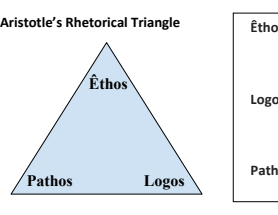
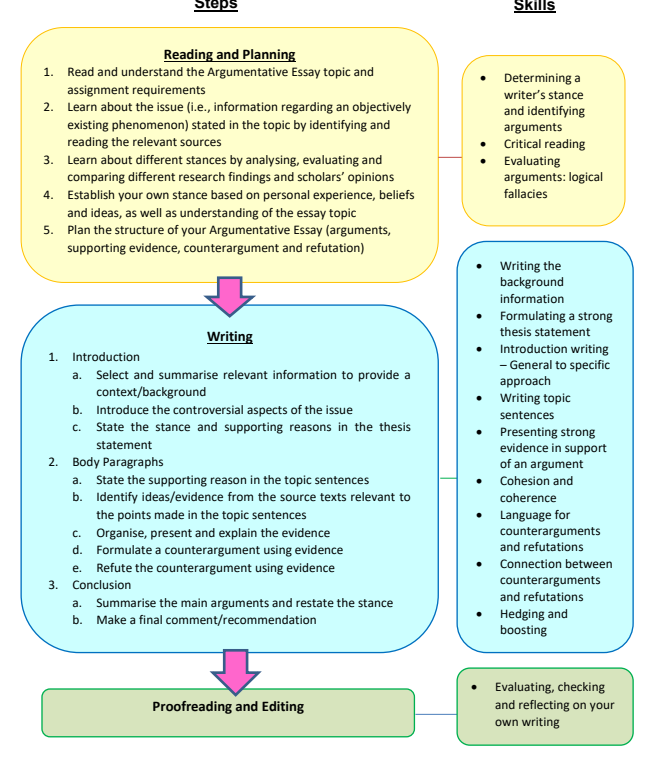
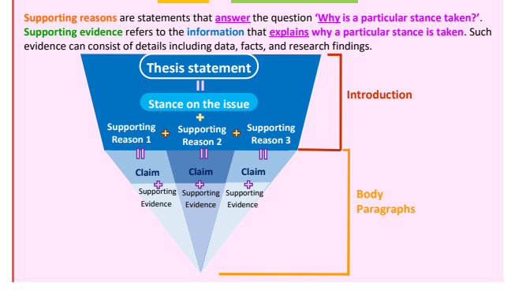
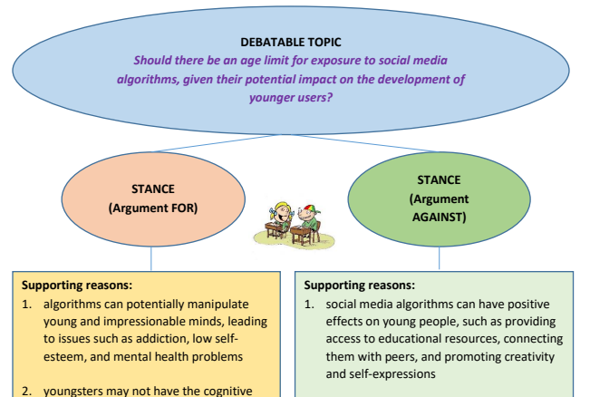
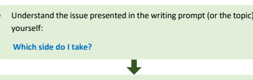
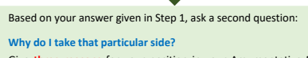
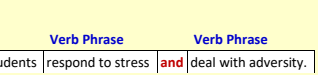
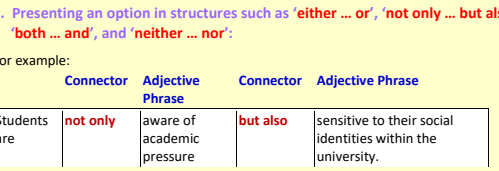
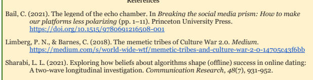

Unit 3 **Writing an Argumentative Essay** 

(Part 1)

## Persuasion And Argumentation

While the Annotated Bibliography focuses primarily on skills in relation to summarising in order to achieve its informative purpose, the Argumentative Essay relies on your ability to **persuade by constructing a** 
valid and compelling argument. By formulating and proposing an argument, you are essentially recommending that your audience adopt a certain stance or course of action in regard to a particular issue. 

To encourage others to adopt a given course of action is not easy, however, and it requires skills in rhetoric. Aristotle defined rhetoric as "the faculty of discovering in any particular case all of the available means of persuasion" (Eidenmuller, 2022, definition 2) and he identified three pisteis (persuasive appeals), 
namely êthos, **logos**, and **pathos**. These three means of persuasion can be visualized as the three corners of a triangle:
Eidenmuller, M. E. (2022). *Scholarly definitions of rhetoric.* American Rhetoric. 

https://www.americanrhetoric.com/rhetoricdefinitions.htm

| Êthos -   | believability and credibility (Why should we  trust the source? What is the basis for its expert  authority?)                                      |
|-----------|----------------------------------------------------------------------------------------------------------------------------------------------------|
| Logos -   | logic and structure (Is there compelling support  in the form of statistics/data/etc.? Is the text's  structure balanced and organised logically?) |
| Pathos -  | appeal to emotion (Does the text make the  audience sad/angry/excited?)                                                                            |

## Argumentative Essay - Steps And Skills

In Units 3 and 4, you will learn about the skills for writing an Argumentative Essay. The following diagram shows you the steps and skills involved. Your teacher will take you through the steps, and you will develop the skills by completing a variety of tasks. 

## Theme: Artificial Intelligence And Social Media

Watch the video titled '**How a handful of tech companies control billions of minds every day**' by Tristan Harris (00:12-06:00)
https://www.youtube.com/watch?v=C74amJRp730

## Activity 1 - While-Viewing Activity

How does the speaker effectively use Êthos/Pathos/Logos to make his speech more persuasive? Note examples from the talk and put them in the respective rows.

Êthos

| Pathos Logos   |
|----------------|

## Activity 2 - Post-Viewing Discussion

1. Jonathan Haidt (an American social psychologist, Professor of Ethical Leadership at New York University Stern School of Business) argues that social media "has radically transformed the nature of peer relationships, family relationships and daily activities" (Haidt & Allen, 2020, p.226).

Do you agree based on your own experience? To what extent do you depend on social media for interacting with others?

Haidt, J., & Allen, N. (2020). Scrutinizing the effects of digital technology on mental health. Nature *(London)*,
578(7794), 226-227.

2. What role does AI play in this transformation, if any?

## █║Critical Reading: Determining A Writer'S Stance And Identifying Arguments

One fundamental feature of argumentative texts is the presence of different standpoints. Authors will sometimes take a quite explicit approach to reveal their stance, while others may express their argument in a more indirect manner by drawing on the voices of others to support or juxtapose their own view. Within one article there may be only one central argument or there may be multiple arguments. By critically reading such texts, you can see who holds what viewpoint within the article, and how the different viewpoints relate to each other, as well as the overarching authorial argument. 

## Reading Skill Determining A Writer'S Stance And Identifying Arguments

What is a writer's stance?

One of the key components in an argumentative essay/research paper is the writer's **position** or point of view with regard to the controversial issue being deliberated. The writer will indicate, very clearly, **in the thesis statement** which side of the issue he or she takes. 

## What Are Counterarguments And Refutations?

Argumentative essays are very much like written debates in which writers also consider and explain opposing points of view on the issue being argued. Cogently addressing such objections, or counterarguments, makes the essay more persuasive and objective. To further strengthen their own argument, writers will then present a **refutation** to rebut, or 'attack', the counterargument. 

How to identify the writer's stance and arguments? 

In Unit 2 (Part 2), you have practised locating the thesis and main ideas (or topic sentences) of a number of reading texts. The same strategies will be employed to identify the writer's stance and arguments in an argumentative essay/research paper. In writing genres such as problem-solution essays, expository essays and business proposals, the term 'main ideas' is often used, whereas in argumentative essays, the term 'arguments' is adopted. 

Some of the information presented in this reading skill section is adapted and modified from: 
Zadina, J. N., Smilkstein, R., & Daiek, D. (2013). *College reading: The science and strategies of expert readers.* Cengage Learning.

## Activity 3 - Identifying Different Stances And Arguments

Identify and summarise the respective opinions and stances of the different stakeholders in the passage according to the colour-coded quotes. Based on the views of those stakeholders, **identify the author's** purpose and stance. 

## Meet The Ai Protest Group Campaigning Against Human Extinction By Morgan Meaker

The first time we speak, Joep Meindertsma is not in a good place. He tears up as he describes a conversation in which he warned his niece about the risk of artificial intelligence causing societal collapse. Afterward, she had a panic attack. "I cry every other day," he says, speaking over Zoom from his home in the Dutch city of Utrecht. "Every time I say goodbye to my parents or friends, it feels like it could be the last time." Meindertsma, who is 31 and co-owns a database company, has been interested in AI for a couple of years. But he really started worrying about the threat the technology could pose to humanity when Open AI released its latest language model, GPT-4, in March. Since then, he has watched the runaway success of ChatGPT chatbot—based first on GPT-3 then GPT-4—demonstrate to the world how far AI has progressed and Big Tech companies race to catch up. And he has seen pioneers like Geoffrey Hinton, the so-called godfather of AI, warn of the dangers associated with the systems they helped create. "AI 
capabilities are advancing far more rapidly than virtually anyone has predicted," says Meindertsma. 

"We are risking social collapse. We're risking human extinction." One month before our talk, Meindertsma stopped going to work. He had become so consumed by the idea that AI is going to destroy human civilization that he was struggling to think of anything else. He had to do something, he felt, to avert disaster. Soon after, he launched Pause AI, a grassroots protest group that campaigns for, as its name suggests, a halt to the development of AI. And since then, he has amassed a small band of followers who have held protests in Brussels, London, San Francisco and Melbourne. These demonstrations have been small—fewer than 10 people each time—but Meindertsma has been making friends in high places. Already, he says, he has been invited to speak with officials within both the Dutch Parliament and at the European Commission. The idea that AI could wipe out humanity sounds extreme. But it's an idea that's gaining traction in both the tech sector and in mainstream politics. Hinton quit his role at Google in May and embarked on a global round of interviews in which he raised the specter of humans no longer being able to control AI 
as the technology advances. That same month, industry leaders—including the CEOs of AI labs Google DeepMind, OpenAI, and Anthropic—signed a letter acknowledging the "risk of extinction," and UK prime minister Rishi Sunak became the first head of government to publicly admit he also believes that AI poses an existential risk to humanity.

Meindertsma and his followers offer a glimpse of how these warnings are trickling through society, creating a new phenomenon of AI anxiety and giving a younger generation—many of whom are already deeply worried about climate change—a new reason to feel panic about the future. A survey by the pollster YouGov found that the proportion of people worried that artificial intelligence would lead to an apocalypse rose sharply in the last year. Hinton denies he wants AI development to be stopped, temporarily or indefinitely. But his public statements, about the risk AI poses to humanity, have resulted in a group of young people who feel there is no other choice. To different people, "existential risk" means different things. "The main scenario I'm personally worried about is social collapse due to large-scale hacking," says Meindertsma, explaining he's concerned about AI being used to create cheap and accessible cyber weapons that could be used by criminals to 
"effectively take out the entire internet." This is a scenario experts say is extremely unlikely. But Meindertsma still worries about the resilience of banking and food distribution services. "People will not be able to find food in a city. People will fight," he says. "Many billions I think will die." But the Pause AI founder also worries about a future where AI advances enough to be classified as "super-intelligent" and *decides* to wipe out civilization, once it understands that humans limit AI's power. He echoes an argument, also used by Hinton, that if humans ask a future super intelligent AI 
system to fulfill any goal, AI might create its own dangerous sub-goals in the process. This concern dates back years and is generally credited to the Swedish philosopher and Oxford University professor Nick Bostrom, who first described in the early 2000s what hypothetically could happen if a super-intelligent AI was asked to create as many paperclips as possible. "The AI will realize quickly that it would be much better if there were no humans, because humans might decide to switch it off," Bostrom said in a 2014 interview. "Also, human bodies contain a lot of atoms that could be made into paper clips. The future that the AI would be trying to gear towards would be one in which there were a lot of paper clips but no humans."
AI research is a divided field and some experts who might be expected to rip Meindertsma's ideas apart, instead seem reluctant to discredit them. "Because of the rapid progress, we just don't know how much of science fiction could become reality," says Clark Barrett, co-director of Stanford University's Center for AI Safety in California. Barrett does not believe a future where AI helps develop cyber weapons is plausible. This is not a field where AI has so far excelled, he claims. But he is less willing to dismiss the idea that an AI system that evolves to be smarter than humans could work maliciously against us. People worry that an AI system "could try to steal all of our energy or steal all of our compute power or try to manipulate people into doing what it wants us to do." This is not realistic right now, he says. "But we don't know what the future can bring. So I can't say it's impossible." Yet, other AI researchers have less patience with the hypothetical debate. "For me, it is a problematic narrative that people claim any kind of proof or likelihood that AI is going to be self conscious and turn against humanity," says Theresa Züger, head of Humboldt University's AI and Society Lab, based in Germany. "There is no evidence that this is going to appear and in other scientific fields, we wouldn't discuss this if there is no evidence."
This lack of consensus among experts is enough for Meindertsma to justify his group's demand for a global halt to AI development. "The most sensible thing to do right now is to pause AI developments until we know how to build AI safely," he says, claiming that leaps forward in AI capabilities have become divorced from research on safety. The debate about how the relationship between these two halves of the AI industry have evolved is also taking place in mainstream academia. "This is something that I've seen getting worse over the years," says Ann Nowé, head of the Artificial Intelligence Lab at the Free University in Brussels. "When you were trained in the '80s to do AI, you had to understand the application field," she adds, explaining it was normal for AI researchers to spend time speaking to people working in the schools or hospitals where their system would be used. "[Now] a lot of AI people are not trained in having this conversation with stakeholders about whether this is ethical or legally compliant."
The government-mandated pause, Meindertsma envisions, would have to be organized by governments of different countries at an international summit, he says. When British prime minister Rishi Sunak announced the UK would host a global summit on AI safety in the autumn, Meindertsma interpreted this as a flash of hope. He believes the UK is well-suited to make sure we're not rushing towards a doomsday scenario. "It's the home for many AI safety scientists. It's where DeepMind is currently located. You have members of parliament already calling for an AI safety summit to prevent extinction."
Yet Sunak's announcement was also tinged with ambitions to make the UK a hub of AI industrysimultaneously revealing that the company Palantir would base its new European headquarters in London—implying the likelihood of the UK advocating for an industrywide pause is remote. Adapted from: Meaker, M. (2023, June 25). Meet the AI protest group campaigning against human extinction. *Wired*. 

https://www.wired.com/story/anthropic-ai-chatbots-ethics/

| Name                          | Professional   | Summary of opinion                                                                                                                                           | Overall stance                       |
|-------------------------------|----------------|--------------------------------------------------------------------------------------------------------------------------------------------------------------|--------------------------------------|
| title                         |                |                                                                                                                                                              |                                      |
| Joep                          | Founder of     | AI may lead to human extinction and                                                                                                                          |                                      |
| Meindertsma                   | Pause AI       | social collapse as it may be used to  create cheap and accessible cyber  weapons. AI developments should be  paused until we know how to  develop AI safely. | Against the rapid  development of AI |
| Geoffrey Hinton Clark Barrett |                |                                                                                                                                                              |                                      |

| Name                                                                                         | Professional     | Summary of opinion   | Overall stance   |
|----------------------------------------------------------------------------------------------|------------------|----------------------|------------------|
| title                                                                                        |                  |                      |                  |
| Theresa Züger Ann Nowé Based on the views and quotes selected to be included in the article, | Overall stance   |                      |                  |
| what do you feel is most likely the author's overall stance?                                 | (for/against):   |                      |                  |
| With which of the views expressed in the article do you most agree?                          | Your own stance: |                      |                  |
| Briefly explain.                                                                             |                  |                      |                  |

## Speaking Activity 4 - Critically Responding To Arguments

The following activity helps you develop skills for making a critical response to arguments in academic texts. These skills will be assessed in the Speaking Assessment. Step 1: Form a group of 4-5 students. Step 2: Individually read the entire extract below.

Step 3: Divide the group into two teams, with one team supporting the author's argument and the other team opposing it. Step 4: Each team summarizes the article's main points, evaluates the author's argument, and expresses their own stance supported by reasons (arguments) and/or examples.

Step 5: Selected groups will share their critical response to the argument with the class.

## "Social Media Controls The Behavior Of Its Users Through Its Design Features." To What Extent Do You Agree With This Statement?

One clear danger of social media networks relates to deindividuation. With the social circle or community that one follows online, a person loses sense of individuality and personal accountability due to conformity ("if they are doing it, it must be right and so I should do it too"). Deindividuation results in ill-disciplining behavior and has been known to encourage negative online behavior such as cyberbullying. Another closely related concern is that social media is the ranking of information according to personalization. The closer certain content matches a person's profile, preferences, behavior, and social circle, the more such content would be displayed to the user (Langlois, 2013). Hence, the communication logics are not about network neutrality, but about social media algorithms and how they organize tracked data. In essence, the more data is tracked, the more relevant needs can be served to users and more satisfied and engaged users become (hence more profitability can be attained through more data) 
(Langlois, 2013). The upshot of this is that users are fed data related to people like them, affirming their in-group identities.

It is argued that by portraying themselves as information service platforms and support providers, social media corporations deemphasize the tremendous control they have in shaping consumer choice and transforming user behavior via data and technological design. Moreover, "by presenting their functions as technical, or uniform and impartial, these companies deny the blatant monopoly they enjoy and consequently the powers of this monopoly" (Patelis, 2013, p. 121).

Adapted from: Rauf, A. A. (2021). New moralities for new media? Assessing the role of social media in acts of terror and providing points of deliberation for business ethics. Journal of Business Ethics, 170(2), 229-251.

| Phrases for Expressing Viewpoints From my point of view, …   | I agree/do not agree with the authors because…   |       |           |             |            |
|--------------------------------------------------------------|--------------------------------------------------|-------|-----------|-------------|------------|
| It is clear that…                                            | The authors' argument is valid/invalid because…  |       |           |             |            |
| … should be promoted/done to address the issue               | … poses a positive/negative impact on…           |       |           |             |            |
| of… Stance                                                   | adverbs                                          | (e.g. | arguably, | apparently, | I suggest… |
| probably, possibly)                                          |                                                  |       |           |             |            |

## Part 3 Academic Vocabulary Understanding Connotation To Identify A Writer'S Stance

Many words lie on a cline of polarity with negatively connotated words on one end ('weird'), 
positively connotated words on the other ('eccentric'), and neutral words in the middle ('unusual'). By increasing your sensitivity to the general 'polarity' of words in the text (i.e., the approximate ratio of positively connotated words to negatively connotated words), you can often rely on this ratio to gain a general understanding of the author's stance on the issue discussed without having to scrutinize each word in the text. Notice the patterns of positive and negative connotations in the following paragraph:

## Example:

Furthermore, this study has implications for economic models of relationships and theorizing about the commercialization of dating through a market lens. Heino et al. (2010) proposed that online dating can activate a consumerist "relationshopping" mind-set that contributes to the illusion that a rewarding relationship is out there waiting to be found rather than actively developed through the work of "relationshipping" (Duck, 1991). In this way, online dating sites "may focus attention on determining the best formula (i.e., level of selectivity) for finding the right person for a successful relationship, rather than on the work and communication skills involved in developing a satisfying relationship" (Heino et al., 2010, p. 443). Although Heino et al.'s research was primarily focused on design features such as profiles and search tools, algorithms may also help cultivate a marketplace mentality by ranking the desirability of potential partners and offering specific recommendations to fill users' needs. Thus, the present results also complement past work by underscoring the importance of people's cognitions about the matching process to the initial success of their online dating relationships.

Sharabi, L. L. (2021). Exploring how beliefs about algorithms shape (offline) success in online dating: A two-wave longitudinal investigation. *Communication Research, 48*(7), 931-952.

| Positively connotated   | Negatively connotated                                                                                                | Neutral               | Overall author                                                                                                                          |
|-------------------------|----------------------------------------------------------------------------------------------------------------------|-----------------------|-----------------------------------------------------------------------------------------------------------------------------------------|
| words/phrases/clauses   | words/phrases/clauses                                                                                                | words/phrases/clauses | viewpoint                                                                                                                               |
| -                       | actively developed through the work of "relationshipping"                                                            |                       |                                                                                                                                         |
| -                       | the work and communication skills involved in developing a satisfying relationship                                   |                       |                                                                                                                                         |
| -                       | the present results also complement past work by underscoring the importance                                         | -                     | the commercialization of dating through a market lens                                                                                   |
| -                       | a consumerist "relationshopping" mind-set                                                                            |                       |                                                                                                                                         |
| -                       | the illusion that a rewarding relationship is out there waiting to be found                                          |                       |                                                                                                                                         |
| -                       | determining the best formula (i.e., level of selectivity) for finding the right person for a successful relationship |                       |                                                                                                                                         |
| -                       | a marketplace mentality                                                                                              | -                     | this study has implications for economic models of relationships                                                                        |
| -                       | Although Heino et al.'s research was primarily focused on design features such as profiles and search tools          | -                     | Online dating seems to be encouraging a more data-driven mindset about the dating process, moving away from a more humanistic approach. |

## Activity 4 - Identifying Connotations

Categorise the connotation of words and phrases in the following two paragraphs as negative/positive/neutral. You do not need to identify the connotation of all **of the diction, just enough** to provide you with a general understanding of the author's overall viewpoint.

## Text A

Importantly, this study does not attempt to make definitive claims about whether algorithms actually work for matching partners. It does, however, provide compelling evidence that people who use algorithms to select a partner may be at least as successful on the first date as those relying on their own judgments. More intriguingly, the results also demonstrate how beliefs about algorithms may function independently from their content to shape relational outcomes in ways that could contribute to success. 

As such, it suggests that even if matching algorithms do not work, as multiple scholars have speculated (Finkel et al., 2012; Joel et al., 2017), it is still possible that they would yield positive outcomes if people trust in their abilities. Thus, scholars examining the effects of algorithms may also want to consider the role of perceptual processes in their use.

Sharabi, L. L. (2021). Exploring how beliefs about algorithms shape (offline) success in online dating: A two-wave longitudinal investigation. *Communication Research, 48*(7), 931-952.

| Positively connotated   | Negatively connotated   | Neutral words/phrases   | Overall author   |
|-------------------------|-------------------------|-------------------------|------------------|
| words/phrases           | words/phrases           | viewpoint               |                  |

## Text B

A final point worth mentioning is that while this study calls attention to the high degree of confidence some have in the abilities of algorithms, there is ongoing debate over how much of that trust is warranted. Algorithms can have enormous societal and interpersonal benefits, but they are also the product of human design and capable of behaving in unexpected ways (Gillespie, 2014; Rainie & 
Anderson, 2017). For instance, some research has shown that online dating has the potential to support inter-racial relationships by introducing people to strangers outside of their existing social networks 
(Ortega & Hergovich, 2018). Yet, others suggest that even well-intentioned online dating algorithms are still susceptible to error and racial bias (Hutson et al., 2018), leading to a push to promote greater algorithmic literacy among users (for an example of what this looks like in practice, see the recent launch of MonsterMatch, 2019). If beliefs are one pathway through which algorithms exert influence in online dating, then this could be extended to understanding their consequences in other fields such as health care, politics, marketing, and finance (Hajian et al., 2016).

Sharabi, L. L. (2021). Exploring how beliefs about algorithms shape (offline) success in online dating: A two-wave longitudinal investigation. *Communication Research, 48*(7), 931-952.

| Positively connotated   | Negatively connotated   | Neutral words/phrases   | Overall author   |
|-------------------------|-------------------------|-------------------------|------------------|
| words/phrases           | words/phrases           | viewpoint               |                  |

## Argumentative Essays

At university, argumentative research papers or essays require **extensive research** to investigate a topic, collect data, and **evaluate evidence** before you can **establish your stance**, and provide ample and relevant support to convince readers to agree with your stance. In University English I, you will practise constructing coherent and well-structured arguments that are supported by evidence which you extract from the materials provided. In University English II, you will learn how to find reliable sources for your argumentative research papers. 

development or critical thinking skills necessary to understand how social media algorithms work, making them particularly vulnerable to their effects 3. an age limit would help parents and caregivers to regulate their children's exposure to social media algorithms, ensuring safer use of such platforms 2. age limits are difficult to enforce, and there is no clear-cut age at which a young person is ready to be exposed to social media algorithms 3. parents and caregivers should be responsible for monitoring their children's social media use, rather than relying on age restrictions to regulate their behaviour
Introduction
- The introduction should set the context by presenting a general review and **background** of the topic.

- Summarise the **main opposing viewpoints** regarding the issue.

- The **thesis statement**, which states your stance and reasons, is usually placed at the end of the introduction.

## Body Paragraphs

- **One supporting reason per paragraph**.

- Each paragraph should **logically connect to the thesis statement**.

- Relevant **supporting evidence** (e.g., statistics, facts, anecdotes) should be included.

- One paragraph should be dedicated to illustrating a stance that is contrary to that of the thesis statement (i.e., a **counterargument**), followed by your response to such objection (i.e., a **refutation**).

## Conclusion

- **Summarise** the main ideas presented in the body paragraphs. - **Reiterate the stance and supporting reasons.** - Make a final remark or comment on the issue.

- **Do not introduce any new information in the conclusion**.

78

## Activity 5 - Evaluating Two Introductory Paragraphs

Evaluate the introductory paragraphs below and answer the questions. Discuss your answers with a partner. Essay topic: "*Does the role of AI online pose potential detrimental effects for users?*

## Example 1

As the time people spend online increases, data analytics and artificial intelligence (AI) have emerged as burgeoning research areas. User data is fed directly into the design of algorithms, enabling companies to provide content customized for individual users (Bail, 2021). Some view this as a positive development, arguing that algorithms can provide users with a confidence afforded by their technological nature and mathematical precision (Sharabi, 2021). This essay, however, posits that the nature of their design is ultimately financially-driven, and thus the primary function is to manipulate users in order to increase companies' profits. It is argued that this manipulation is essentially harmful, a harm which manifests in the reinforcement of ***echo chambers**, a reduction in the quality of information online, and the outsourcing of significant personal decisions to these algorithms.

* **echo chamber** - an environment in which a person is repeatedly and only exposed to beliefs, ideas, and opinions similar to their own

## Example 2

We love to go shopping online nowadays. Companies can use AI to convince us to buy different things. 

Some people think it's good because the algorithms can make the decisions for them instead of having to decide for themselves. I think that these algorithms are bad, though. The algorithms bring many disadvantages to people online. I will discuss these in the following essay.

1. Is the background of the topic introduced in both introductions? 2. Is the thesis statement included in both introductions? If yes, highlight it.

3. Can you identify the writer's stance (argument for/against) from the thesis statement? If so, what is it?
4. Can you identify the supporting reasons in the essays' thesis statements?

5. Which of the two introductions seems to be more suitable for use within an academic essay?

Which features seem particularly appropriate/inappropriate?

## █║ Components Of An Introduction Of An Argumentative Essay

The introduction of an argumentative essay consists of two core components.

## 1) Background

You should introduce the topic by providing some brief background information on the issue. You can define the key terms (if necessary), describe the global or societal context or situation, and include the main opposing viewpoints related to the topic. 

## 2) Thesis Statement

A strong thesis statement should: 
- Clearly state **your position** or your point of view in relation to the issue - Be **concise** and **narrow** - Be **debatable** (i.e., it should not be a fact)
- Include the **supporting reasons** underpinning your position

## █║ Formulating A Strong Thesis Statement

An example of a strong thesis statement of an argumentative essay:
This essay argues that there should be an age limit for exposure to social media algorithms **[writer's** 
position] because imposing an age limit can mitigate the risks of social media algorithms to the mental health and well-being of young people, protect younger users from algorithmic bias, and encourage clear guidance from parents and caregivers regarding the appropriate use of social media [supporting reasons].

## What Is A Debatable Statement?

Your thesis should take a position which others can challenge or dispute. If the thesis expresses a proposition that is generally agreed upon, there is no reason for you to try to persuade readers to agree with your stance. 

Example of a non-debatable statement: Water is essential for human survival. This statement is not debatable (i.e., it is demonstrably factual) because no one can possibly and reasonably argue that homo sapiens can live without water. 

Example of a debatable statement:
Reducing the number of private cars is the most effective way to reduce air pollution in Hong Kong. 

This statement is debatable because it allows for disagreement. Depending on how 'effectiveness' is measured, some may argue that cutting emissions from power plants rather than reducing the number of private cars is the most effective strategy. 

## █║ Steps To Formulating A Strong Thesis Statement

Follow the steps below to help you generate a strong and debatable thesis statement. 

- Give three **reasons** for your position in your Argumentative Essay (AE) in University English I

- Combine your position and your three reasons into one thesis statement, and join the three reasons together using parallel structure
- Make sure the order in which you present the reasons in the thesis statement is the same as in the body paragraphs

## Language Skill For Writing Parallel Structure

When listing a sequence of ideas, parallel structure, or parallelism, is often used to present the ideas. 

By introducing a list of ideas using repetitive grammatical patterns, parallelism gives the text clarity, efficiency (saves text space) and enhances its readability. Examples of sentence patterns in which parallel structure is used are:

For example: 

The study aims to look at how students respond to stress **and** deal with adversity.

Remember, if the parallel elements are adjective or verb phrases, they must share the same subject. Parallelism is often applied **in the thesis statement** where the reasons supporting the writer's position are presented.

An example of a parallel thesis statement: 
Efforts to assess student mental health should focus on **identifying higher risk students**
because *it would* **provide more data regarding different categories of mental health** 
issues faced by those students and provide timely care to the student demographic with the greatest need. 

[Here, the two parallel elements share the same subject, i.e., 'it' = 'identifyin**g higher** 
risk students']

## Activity 6 - Evaluating Thesis Statements

Which of the following can function as thesis statements? For those which are unsuitable, modify them accordingly to make them suitable for use as thesis statements. 

1. A.l. is harmful to society.

2. Online dating applications turn romance into a business transaction, encourage superficial judgement of potential partners, and create an unfair playing field for men and women.

3. The purpose of this paper is to illustrate the potential benefits of reducing social media use. 4. I am an ardent supporter of legislation to regulate the use of addictive algorithms by social media companies and my reasons will be elaborated in the following paragraphs.

5. As part of their corporate social responsibility, social media companies like Twitter and Facebook should reduce opportunities for public performance, the potential harmful effects of unverified accounts, and the availability of low-quality information.

## Activity 7 - Practice Writing A Thesis Statement

Choose one of the two topics below. Decide which position you would like to take and come up with three reasons supporting your position. Write a strong thesis statement expressing your stance and the supporting reasons. **You may consider using ChatGPT to help you brainstorm ideas.**
1. Should social media platforms be more transparent about their algorithms and how they influence user behavior?

| My position Reason 1 Reason 2 Reason 3 Thesis statement   |
|-----------------------------------------------------------|

2. Should social media companies be held responsible for the mental health effects of their algorithms on users?

| My position Reason 1 Reason 2 Reason 3 Thesis statement   |
|-----------------------------------------------------------|

## Speaking Activity 5 - Critically Expressing Your Own Stance

The following activity helps you develop skills for making a critical response to arguments in academic texts. These skills will be assessed in the Speaking Assessment.

## Step 1: Form A Group Of 4 Students.

Step 2: Individually read the entire extract below.

Step 3: All group members take turns to critically respond to the argument in the extract and express their own stance on the issue (within 2 minutes). The stance should be supported by reasons and/or examples. 

Step 4: Other members of the group use the Peer Evaluation Form to evaluate the quality of each critical response. 

Step 5: Within each group, members vote for the most persuasive speech.

## Should Social Media Companies Be Held Responsible For The Mental Health Effects Of Their Algorithms On Users?

The design features social media firms use to make their platforms more addictive should be used for the opposite purpose: to empower users to have a healthier relationship with social media. Importantly, these are fixes tech companies could implement with relative ease. For example, Apple has implemented features into its most recent iOS operating system to alert the user to his or her phone's usage statistics 
(e.g., hours spent on the device, number of instances a user turned on his or her phone). Something similar could be done for social media. Harris (2018) suggests other helpful design features, including alerting users to the estimated time they would spend were they to log in to a given website, alerting them to how long ago they logged in, and more.

These suggestions are similar to the sorts of suggestions Sunstein and Thaler (2008) make in their discussion of nudges: in the same way that use of an opt-out on an organ donor form dramatically increases the number of donors, social media companies could assume that users opt out of the use of addictive aspects of technology unless they explicitly opt in (see also Goldstein et al., 2008). Indeed, such changes could potentially liberate countless users from their social media addiction.

Adapted from: Bhargava, V. R., & Velasquez, M. (2021). Ethics of the attention economy: The problem of social media addiction. *Business Ethics Quarterly*, 31(3), 321-359.

| Peer Evaluation Form Criteria (Total: 50 marks)                                                                                                                                                                                                                                                                                                                                                                                                                                                                                                                                  | Scores            | Comments and Examples   |
|----------------------------------------------------------------------------------------------------------------------------------------------------------------------------------------------------------------------------------------------------------------------------------------------------------------------------------------------------------------------------------------------------------------------------------------------------------------------------------------------------------------------------------------------------------------------------------|-------------------|-------------------------|
| Summary coverage and accuracy (10 marks) - Accurate understanding of the original text - Comprehensive yet concise summary of the main ideas of the original text                                                                                                                                                                                                                                                                                                                                                                                                                | Covered in Unit 2 |                         |
| Relevance and criticality (20 marks) - A focused response which is highly relevant to the information/viewpoint provided in the extract - Student's own viewpoint is clearly and critically stated and is supported by reasons and/or examples Organisation (10 marks) - A coherent response with clear logical reasoning - Appropriate and natural use of signaling phrases - Appropriate time management Clarity (10 marks) - Clear and accurate pronunciation - Effective use of pauses, stress and intonation - Preciseness of word choices - Grammatical accuracy - Fluency |                   |                         |

## █║ Developing A Well-Structured Body Paragraph

Each of the sentences of your body paragraphs for the Argumentative Essay (AE) should perform a specific function in support of the overall main idea of the paragraph, and less directly, in support of the thesis of the essay. Within the body paragraphs, the sentences will typically perform the following functions: 

| Point                                                                                                                                                          | -                                                                                  | The first sentence of the body paragraph will typically serve the function of a topic sentence. There could be more than one topic sentence in a paragraph.         |
|----------------------------------------------------------------------------------------------------------------------------------------------------------------|------------------------------------------------------------------------------------|---------------------------------------------------------------------------------------------------------------------------------------------------------------------|
| -                                                                                                                                                              | One of the supporting reasons for your stance on the issue                         |                                                                                                                                                                     |
| -                                                                                                                                                              | An opinion of what is true or what action should be taken                          |                                                                                                                                                                     |
| Evidence                                                                                                                                                       | -                                                                                  | Types of evidence: facts, statistics, anecdotes, research findings, quotations, examples, etc.                                                                      |
| -                                                                                                                                                              | Reasons why the Evidence supports and explains the topic sentence of the paragraph |                                                                                                                                                                     |
| -                                                                                                                                                              | Discussion of what the Evidence means and how the Evidence is relevant             |                                                                                                                                                                     |
| Explanation/ Elaboration Link                                                                                                                                  | -                                                                                  | Sets the stage for transitioning to a sub point within the same paragraph or a new point beginning the next paragraph, or summarises the main idea of the paragraph |
| Note: The end of a body paragraph may not always perform the 'Link' function;  it may sometimes summarise (not simply repeat) the main idea of the  paragraph. |                                                                                    |                                                                                                                                                                     |

The *P.E.E.L.* paragraph structure will help you evaluate:

- whether the evidence and explanations are well-balanced
- whether the evidence is related and logically connected to the topic sentence (i.e., checking for coherence)

## Note In The Sample Paragraph Below How These Different Sentence Functions Work Together:

Leaving social media does not simply mean going back to the way things were - it means giving up their way of life. (Point) Sara Rendon, briefly left social media after she was threatened by extremists for supporting her husband's right to bear arms. However, she soon came back to Twitter and Facebook because she felt that they were the only way for her to get regular updates about her siblings, nieces, and nephews who lived far away. (Evidence) Other people interviewed for this book who took temporary leaves of absence from social media reported similar fears about missing out. (Evidence) These examples show that quitting social media can incur fear and anxiety among the users as a result of the disconnect from social media. (Explanation) Often this fear extends beyond friends and family members and into the social media communities where people spread information about their interests, hobbies, or fields of employment. (Link)
While some people are sucked back in because they miss some type of social connection, others are pushed back onto platforms by friends, family members, or colleagues. (Point) Many people…
Adapted from: Bail, C. (2021). Should I delete my account? In Breaking the social media prism: How to make our platforms less polarizing (pp.84-98). Princeton University Press.

## Activity 8 - Analysing The Structure Of A Body Paragraph Identify The Sentences Within The Following Paragraph According To Their Function (Point/Evid/Expl/Link).

Social media companies use so-called adaptive algorithms that continuously refine their platforms such that they can become more addictive for each user. ( ) The algorithms embedded in social media adjust the content they feed each user in a manner by which the user will remain engaged with the platform for even longer. ( ) This is made possible by monitoring the amount of time particular kinds of content keep the particular user engaged with the platform, and platforms use that data to continuously adjust the content so that the user remains engaged with the platform for increasingly lengthening periods of time (Lee et al., 2018). ( ) The user's engagement with social media, then, produces an addictive feedback loop: the more one uses the platform, the more data the platform's algorithm has about what keeps that particular user engaged, and the more the algorithm feeds that particular user precisely the content that will keep them engaged even longer, and so the more addictive the platform becomes for that particular individual. ( )
Adapted from: Bhargava, V. R., & Velasquez, M. (2021). Ethics of the attention economy: The problem of social media addiction. *Business Ethics Quarterly,* 31(3), 321-359.

## Writing Skills Writing Effective Topic Sentences

Topic sentences should be:

1. concise and clear, with a topic and controlling idea 2. followed by highly relevant supporting information (e.g., evidence, elaboration) 3. the first sentence in the paragraph (usually) 4. the most general statement within the paragraph (vs. supporting sentences, which provide details)
Here are two examples of effective topic sentences with their corresponding supporting sentences:
One of the main differences between online dating and traditional courtship is the manner in which partners are introduced. According to Finkel et al. (2012), online dating sites can be broadly classified as using two different methods for narrowing the field of available partners: self-selection and algorithm-selection. Self-selection methods function much like online personal advertisements in their approach to matchmaking (Sprecher, 2009). With self-selection, online daters are tasked with choosing a partner for themselves by browsing through profiles and using the site's search function to filter results (e.g., by age, height, or location). In contrast, algorithmselection methods utilise self-report and behavioural data in the matchmaking process 
(Sprecher, 2009). 

Sharabi, L. L. (2021). Exploring how beliefs about algorithms shape (offline) success in online dating: A twowave longitudinal investigation. *Communication Research, 48*(7), 931-952.

Social media platforms, particularly those platforms that achieve a great deal of popularity and profit, must bear responsibility for their design decisions. Their programming practices may inadvertently advocate for certain groups of people while alienating others. The values they bake into their software have the capacity to influence the next generation of platforms that will go on to play an intermediary role in shaping society's construction of itself. To be clear, however, we do not advocate for genderless online spaces. While some may wish to avoid online gender identification to block gender-related ad targeting or maintain privacy, gender remains a salient and important marker of personal identity for many. 

Bivens, R., & Haimson, O. L. (2016). Baking gender into social media design: How platforms shape categories for users and advertisers. *Social Media + Society, 2*(4), 12. https://doi.org/10.1177/2056305116672486

## Does The Following Topic Sentence Meet These Four Criteria?

Facebook, Twitter, and other social media platforms have produced exciting new opportunities to study *echo chambers. The social sciences were once considered "data poor" compared to other fields of study. But some platforms now allow researchers to collect information about millions of people in seconds. Even more importantly, research of ideas can be conducted, tracing how beliefs about the world spread across large social networks over time. The age of computational social science—the study of human behaviour using large digital data sets—also provides new opportunities for experimentation. By embedding randomised controlled trials within social media platforms, social scientists have been able to increase voter turnout, organ donation, and a host of other positive human behaviours. These types of experiments also hold enormous power to provide insights into social media echo chambers.

* **echo chamber** - an environment in which a person is repeatedly and only exposed to beliefs, ideas, and opinions similar to their own Adapted from: Bail, C. (2021). The legend of the echo chamber. In *Breaking the social media prism: How to make our platforms* less polarizing (pp.1-11). Princeton University Press.

## Activity 9 - Writing Effective Topic Sentences

Compose suitable topic sentences for the following paragraphs based on the supporting sentences provided. The words in blue may give you some hints.

1.

______________________________________________________________________
Throughout history humans have been infatuated with spectacles and stories. While fascination with spectacles has not deteriorated and is a quintessential part of consumer culture (Kozinets et al., 2004), 
the party telling the story has now changed. Whereas traditional media companies controlled how and which stories were presented to the public previously, with new media anyone can become a storyteller. This disruption of power, where power can immediately change hands to those of the consumer, and where the spectacle society rewards bizarre, outrageous, and inane behavior like cat videos or terrorist attacks, casts a negative outlook on consumer behavior.

Adapted from: Rauf, A. A. (2021). New moralities for new media? Assessing the role of social media in acts of terror and providing points of deliberation for business ethics. Journal of Business Ethics, 170(2), 229-251.

2. This is especially important given that the platforms themselves are increasing in addictive potential due to the use of adaptive algorithms. Imagine if every time one bought coffee from their neighborhood café, the coffee, unbeknownst to the customer, spiked in addictiveness (Bhargava & Velasquez, 2021). This, obviously, would be troubling. But it might be made less bad if the café were to tell you that it would increase the addictiveness of your coffee each time you purchased coffee there. Tech firms, similarly, owe it to their users to make it clear that they are employing the users' usage data in ways that will not only make the experience better, but may also make the platform more addictive.

Adapted from: Bhargava, V. R., & Velasquez, M. (2021). Ethics of the attention economy: The problem of social media addiction. *Business Ethics Quarterly*, 31(3), 321-359.

## █║ Presenting Strong Evidence In Support Of An Argument

To make your argument objective and persuasive, it is important that the evidence is made up of facts, information, and expert opinions rather than your personal beliefs and values. As discussed in Unit 2, common types of evidence include facts, data/statistics, examples, quotes, anecdotes, and research findings. To construct a strong argument, make sure you also check the credibility of the source and **evaluate the strength of your chosen evidence**. If you incorporate external evidence, remember that you should properly **acknowledge the source** of such information. You may review relevant sections in Unit 2 for 'in-text citation techniques'.

To ensure that your argument is sufficiently supported, you should ask the question 'Why …?', **'How …?'** or **'What makes …?'**
For example, if your argument is that there should be an age limit for exposure to social media algorithms, you should ask yourself questions such as:
- What makes an age limit for exposure to social media algorithms **controversial?**
- **What is the significance of imposing the age limit?** - **What evidence is needed to show the importance of imposing the age limit?**

______________________________________________________________________
_____________________________________________________________________.
Note!

In the argumentative essay assignments for University English I, you have to incorporate evidence from external sources in **your body paragraphs**. Appropriate in-text citation techniques need to be applied. 

## █║ Explaining The Significance Of Evidence

One of the core components in the *P.E.E.L.* paragraph structure is the inclusion of evidence. Since evidence does not speak for itself, you have to show your readers why **the evidence is important** and explain how **that evidence supports your argument**. That means, it is necessary to include the 'Explanation' or 'Elaboration' of evidence in a well-structured paragraph. 

| This research shows that …   | This supports the idea that …   |
|------------------------------|---------------------------------|
| As this evidence shows, …    | This illustrates that …         |
| That means …                 | The finding suggests that …     |

## Example 1:

| The emphasis on profitability baked into algorithms not only affects how people align  their beliefs and identities in relation to information online, but also the nature of the  information itself. Arguably this phenomenon is no more apparent than in the case  of information sharing online. With recent improvements in AI technology,   |                                                                                                                                                                                                                                                                                                                                      |
|---------------------------------------------------------------------------------------------------------------------------------------------------------------------------------------------------------------------------------------------------------------------------------------------------------------------------------------------------|--------------------------------------------------------------------------------------------------------------------------------------------------------------------------------------------------------------------------------------------------------------------------------------------------------------------------------------|
| Evidence                                                                                                                                                                                                                                                                                                                                          | information is more accessible and negotiable than ever before. At the same time,  however, information is thus increasingly decentralized and of questionable  reliability (Limberg & Barnes, 2018), and in some cases misinformation is even  deliberately disseminated for political purposes (Bail, 2021). This decentralization |
| Explanation/ Elaboration                                                                                                                                                                                                                                                                                                                          | may open up business opportunities, but it also inevitably results in the production  of an unprecedented volume of low-quality information online. After all, the  fundamental goal of the algorithms is not to increase online users' knowledge or  enrich their lives, but rather to attract and keep their attention.            |

## Activity 10 - Explaining The Significance Of Evidence

Compose a sentence to function as Explanation/Elaboration of the preceding point in the paragraphs below:
1. Social media addiction contributes to the loss of work–family balance. This balance represents an energetic personal resource that occurs when an employee is accomplishing "role-related expectations that are negotiated and shared between an individual and his/her role-related partners in the work and family domains" (Carlson et al., 2009; Grzywacz & Carlson, 2007, p. 458). As an individual becomes more addicted to social media, This could prompt resource loss, whereby the addiction requires increasing investment of resources to feed it, which are then diverted from other areas that may need it. As a result, the employee is less likely to be able to accomplish goals at work or in his or her family life, creating a distinct lack of balance in both domains.

Adapted from:
Zivnuska, S., Carlson, J. R., Carlson, D. S., Harris, R. B., & Harris, K. J. (2019). Social media addiction and social media reactions: The implications for job performance. The Journal of Social Psychology, 159(6), 746760.

2. Social media reactions often create a sense of emotional exhaustion or burnout in the employees. Experiencing strong emotions can be a source of stress that can diminish our capacity for emotional resilience. For example, a strong anger reaction can increase blood pressure (Dimsdale et al., 1986), 
heart rate (Brosschot & Thayer, 2003), adrenaline (Funkenstein, 1955), cortisol (Moons, Eisenberger, 
& Taylor, 2010), and muscle tension (Ax, 1953), among other responses. Emotions may even have a pervasive effect on mood (Weiss & Cropanzano, 1996). As energy stores decrease, employees are likely to experience the exhaustion associated with job burnout.

Adapted from:
Zivnuska, S., Carlson, J. R., Carlson, D. S., Harris, R. B., & Harris, K. J. (2019). Social media addiction and social media reactions: The implications for job performance. The Journal of Social Psychology, 159(6), 746-760.

# █║ Constructing A Coherent Body Paragraph

## Cohesion

Cohesion represents "the means whereby a text is enabled to function as a single meaningful unit" and "whereby elements that are structurally unrelated to one another are linked together, through the dependence of one on the other for its interpretation" (Halliday & Hasan, 1976, p.27).

Halliday, M. A., & Hasan, R. (1976). *Cohesion in English*. Longman, London.

Cohesion, in other words, creates connections across the text (usually across main clauses, or even farther distances). It forms these connections through four subsystems of cohesive devices, namely Lexical cohesion, Conjunction (connectives), **Reference**, and **Ellipsis**. Note how these devices create cohesive ties in the paragraph below:
Bruce Tuckman, a psychology researcher in group dynamics, established his famous "stages of group development" model in 1965. He believed that there were four necessary stages that newly formed groups need to progress through in order to tackle their shared challenges. The first stage (of group development) is *forming*, when a team first comes together and individuals, (who are) mainly focused on themselves, operate with a degree of politeness. The second (stage of group development) is *storming*, 
when comfort within the group allows for conflicting opinions to be voiced. This may lead team members to wrestle for control of the group's values and goals. Thirdly (the third stage of group development) is norming, when "resolved disagreements and personality clashes result in greater intimacy, and a spirit of cooperation emerges." The final stage is *performing*, where, with "group norms and roles established, group members focus on achieving common goals, often reaching an unexpectedly high level of success."
Limberg, P. N., & Barnes, C. (2018). The memetic tribes of Culture War 2.0. *Medium*. https://medium.com/s/worldwide-wtf/memetic-tribes-and-culture-war-2-0-14705c43f6bb

| Lexical cohesion (meaning                                 | Synonymy: group, team / values, goals                                                                                             |
|-----------------------------------------------------------|-----------------------------------------------------------------------------------------------------------------------------------|
| relations among words)                                    | Antonymy: individual, group / cooperation, clashes Collocation: tackle - challenges / progress - stages / resolved - disagreement |
| Conjunction (connecting  clauses with logical  relations) | Temporal conjunctions of sequence - first / second / Thirdly / final                                                              |
| Reference ("pointing" in                                  | Definite article 'the' / demonstrative pronoun 'this'                                                                             |
| the text)                                                 |                                                                                                                                   |

| Ellipsis (omitted elements   | Omitted postmodifier of noun phrase (of group development) /                                                                                                     |
|------------------------------|------------------------------------------------------------------------------------------------------------------------------------------------------------------|
| which are understood)        | reduced relative clause (who are) / noun phrase other than definite  article (stage of group development) / noun phrases (the third stage of  group development) |

## Activity 11 - Practice Tasks On Cohesive Devices

1) **Lexical cohesion** (synonymy, antonymy, collocation, etc.) - connections among interrelated words or phrases in the text
How many different synonyms for the idea "social media" can you find in the following paragraph?

Since our social lives are now peppered with digitally mediated encounters, software components literally join us as we engage in everyday social practices, whether we are conscious of their presence or not (Beer, 2013; Kitchin & Dodge, 2011). For many, social media sites have become integral platforms for socializing. Indeed, social media companies capitalize on this trend; they are programmed spaces designed for digital identity construction (Boyd, 2011). Yet, these platforms often position themselves as neutral or open online spaces designed specifically for users, when their primary goals actually involve generating, capturing, and controlling user data, affording platforms great power over users (Gehl, 2011; Gillespie, 2010; van Dijck, 2013). 

By emphasizing neutrality, platforms can more easily conceal important choices about what can appear on the site and how data are archived, owned, and monetized (Gehl, 2011; Gillespie, 2010).

Bivens, R., & Haimson, O. L. (2016). Baking gender into social media design: How platforms shape categories for users and advertisers. Social Media + *Society*, 2(4), 12. https://doi.org/10.1177/2056305116672486

2) **Conjunction (connectives)** - can be generally grouped into four basic categories of logical relations (ADDITIVE e.g., 'furthermore' / CAUSAL e.g., 'so' / ADVERSATIVE e.g., 'however' / TEMPORAL e.g., 'secondly')
Fill in the blanks with suitable connectives **(conjunctions/adverbials/prepositional phrases)**
which accurately reflect the logical relationship between the preceding and following clauses.

The literature on online dating also demonstrates how algorithms may play a role in shaping different aspects of people's experiences on these sites. Courtois and Timmermans (2018), 
1) _______________ , observed that rather than rewarding users for swiping more, Tinder's algorithm may discourage behaviours that cause them to exhaust their most desirable matches too quickly. 2) ___________ , algorithms have been shown to influence people's decisions regarding potential partners. 3) _________ , experimental research on online dating suggests that although people enjoy the control that comes with self-selection, they prefer formats that offer algorithmic input into the decision-making process while still leaving the final choice to the user (Tong et al., 2016). Studies also indicate that algorithms can benefit users by simply restricting the dating pool to a finite number of available partners, which may also limit the competition and encourage others to more seriously consider them (Halaburda et al., 2018). 4) _____ , one topic that has not been sufficiently addressed is how people perceive algorithmic involvement in online dating. It stands to reason, 5) _______ , that individuals who elect to use algorithm-selection methods will be more confident than others in their matching abilities.

Sharabi, L. L. (2021). Exploring how beliefs about algorithms shape (offline) success in online dating: 
A two-wave longitudinal investigation. *Communication Research, 48*(7), 931-952.

## 3) Reference

As the name suggests, reference is a cohesive strategy used to "point" (refer) either forwards (cataphoric, less common) or backwards (anaphoric, more common) in a text to a referent (the original entity which is being referred to).

Reference often takes the following grammatical forms:

## A. Pronouns And Determiners ('This', 'It', 'That', 'Those', Etc.):

We supplemented our walkthroughs with background research about each platform. ***This**
(demonstrative pronoun) included "About Us" pages, mission statements, advertising terms, each platform's Wikipedia page, and online searches to determine whether any gender fieldrelated changes had been made throughout the years.

In recent years, several popular social media platforms have launched freeform custom gender fields. ***This** (determiner) decision reconstitutes gender categories beyond an oppressive binary only permitting "males" and "females."

## B. Definite Article ('The'):

Industry experts argue that targeting strategies ought to couple demographic data with behavioural and taste-based data (Churchill, 2013; Smith, 2014). Yet, Cheney-Lippold (2011) readjusts *the critique, reminding us that advertisers' efforts to categorize us do damage beyond our pocketbooks.

* N.B. both demonstrative determiners and the definite article are often paired with synonyms to create strong ties of cohesion

## C. Comparatives ('Similarly', 'More', 'Less', Better, Etc.):

This included "About Us" pages, mission statements, advertising terms, each platform's Wikipedia page, and online searches to determine whether any gender field-related changes had been made throughout the years. For our background research, we were **most** interested in changes to gender fields on sign-up pages and profile pages that took place since the launch of the platforms, public outcry over gender-related data fields and collection, ownership changes, and platform-to-platform alliances. 

## D. Other Phrases ('Respectively', 'Former', 'Latter'):

There is a clear disconnect between platform owners' motivations for offering particular gender options and social media users' desires and motivations for using particular gender options. **The** 
former is almost completely about data collection, advertising, and revenue opportunities. The latter is about online self-presentation. 

In the following paragraph, circle all examples of cohesive reference as well as draw a line from the reference to its referent (the original item it is referring to): 
All users must eventually visit a sign-up page if they wish to participate in a social media network. Once they do, sign-up pages block access to the site until all mandatory fields are completed. However, designers are also cognizant of the need to advance users past the gateway before they deem the process too onerous and leave. This impetus helps sign-up pages acquire a level of invisibility. They continue to exist within the software, but they are intended as transitory spaces that quickly disappear from view. 

4) **Ellipsis/Substitution** - This subsystem of cohesion "makes it possible to leave out parts of a structure when they can be presumed from what has gone before" (Halliday & Matthiessen, 2014, p. 606). By omitting or replacing (in a shortened form) language elements that are already implied or understood by the writer and are thus unnecessary, you are actually increasing the cohesion of the text by avoiding unnecessary repetition and superfluous word use. There are three grammatical categories of ellipsis/substitution (note that omitted content is indicated in parentheses):
Halliday, M. A. K., & Matthiessen, C. M. I. M. (2014). Halliday's introduction to func*tional grammar* (4th ed.). Routledge.

a. Nominal (noun)
E.g., Not **all groups** are successful. Some (*groups*) abort during the storming phase - and if we apply this model to the noosphere, we see that all the tribes are in the midst of it.

## B. Verbal (Verb)

E.g., On one side, people have evolved instincts suited to a bygone ecology, and on the other, (*there is*) an army of high-IQ engineers tasked with creating algorithms aimed solely at capturing and holding their attention.

c. Clausal (omission of clausal elements)
E.g., If we are to survive as a species, we must **address our collective challenges and**
existential risks - **from rogue A.I. to environmental disaster**. To do so (address our collective challenges and existential risks - *from rogue A.I. to environmental disaster*), we're going to have to build the bridge from storming to norming.

The above examples are taken from: Limberg, P. N., & Barnes, C. (2018). The memetic tribes of Culture War 2.0. Medium. https://medium.com/s/world-wide-wtf/memetic-tribes-and-culture-war-2-0-14705c43f6bb In the following pairs of sentences, some information from the first sentence has been omitted or substituted in another form in the second sentence because it is already implied. Indicate which specific elements (words or phrases) have been omitted **or replaced.**
1. Second, participants self-reported how they were matched with their partner, which, while consistent with this study's focus on perceptions, could have produced some inaccuracies.

It also means that some could not say for certain if an algorithm was (or was not) involved.

2. Commercial intermediaries have long existed in the marriage market (Ahuvia & Adelman, 1992).
Few, however, have received quite the same quick and widespread adoption as online dating.

Adapted from:
Sharabi, L. L. (2021). Exploring how beliefs about algorithms shape (offline) success in online dating: A two-wave longitudinal investigation. *Communication Research, 48*(7), 931-952.

## Activity 12 - Enhancing The Cohesiveness Of A Paragraph

Make any changes necessary to improve the cohesiveness of the following paragraph using lexical cohesion, reference, conjunction, and ellipsis/substitution. 

Algorithms are often assumed to operate invisibly outside the purview of most people's awareness (Bucher, 2017). Some notable exceptions of algorithms which do not operate invisibly outside the purview of most people's awareness include PageRank, Google's search engine algorithm, and EdgeRank, which is the algorithm which was once powering Facebook's newsfeed. Many internet users are familiar with algorithms on a rudimentary level, and research is beginning to indicate that users' familiarity with algorithms may affect their behaviours online (Gillespie, 2014). Rader and Gray (2015) conducted a qualitative inquiry of users' beliefs surrounding Facebook's algorithm, which uncovered various ways users adapted their behaviour in response to perceptions of algorithmic curation in their newsfeeds on Facebook. Through a series of interviews, Bucher (2017) determined that users' awareness of Facebook's algorithm impacted users' engagement with Facebook, from which posts users liked to when they shared content on Facebook.

Adapted from: Sharabi, L. L. (2021). Exploring how beliefs about algorithms shape (offline) success in online dating: A two-wave longitudinal investigation. *Communication Research, 48*(7), 931-952.

## Information Flow Principle

Coherence refers to the extent to which all of the parts of the text fit together as a 'coherent' (unified) whole. To achieve this unity, particular attention should be paid to the transitions between sentences to maintain a logical flow of ideas within your academic writing. According to the **Information Flow Principle** (IFP), the flow of information between sentences will typically follow a given - new pattern, by which new information (information previously unknown to you as the reader) is placed after *given* information which you "already know about or have accessible to you" (Halliday & Matthiessen, 2014, p. 119). 

Halliday, M. A. K., & Matthiessen, C. M. (2014). Halliday's introduction to functional g*rammar* (4th ed.). London: 
Routledge.

Compare the following paragraphs. Which of the paragraphs seems to feature a smoother flow between sentences? What differences do you notice in the transitions between sentences?

## Paragraph A

We sent all study participants a follow-up survey that included many of the questions asked in the first survey. **Even after using the website for just a short time,** people who used the website exhibited significantly lower levels of polarization. **In terms of attitudes,** there were fewer negative views toward the other party or people subscribed less strongly to stereotypes about them. More moderate views about the political issues or social policies designed to address them were presented by others. **On all of these measures,** people became a lot less polarized.

## Paragraph B

We sent all study participants a follow-up survey that included many of the questions asked in the first survey. **People who used the website** exhibited significantly lower levels of polarization after using it for just a short time. **Many people** expressed fewer negative attitudes toward the other party or subscribed less strongly to stereotypes about them. **Others** expressed more moderate views about the political issues they discussed or social policies designed to address them, while some even became less polarized on all of these measures. 

Adapted from: Bail, C. (2021). The social media prism. In Breaking the social media prism: How to make our platforms less polarizing (pp.41-53). Princeton University Press.

Paragraph B flows much more smoothly. But why? The given - new pattern in Paragraph B is clearly more consistent, but how is flow disrupted in Paragraph A? To further illustrate the concept, note the difference in the transitions between sentences of Paragraph A as compared to B. How is a smoother flow achieved in Paragraph B? 

## Paragraph A

We (GIVEN) sent all study participants a follow-up survey that included many of the questions asked in the first survey (NEW). 

Even after using the website for just a short time (NEW), people who used the website (GIVEN) exhibited significantly lower levels of polarisation (NEW).

In terms of attitudes (NEW), there were fewer negative views toward the other party or people (GIVEN). 

More moderate views about the political issues or social policies designed to address them were presented by others (NEW). On all of these measures, people became a lot less polarised (GIVEN). 

## Paragraph B

We (GIVEN) sent all the website users from our study a follow-up survey that included many of the questions asked in the first survey (NEW). 

People who used the website (GIVEN) exhibited significantly lower levels of polarisation after using it for just a short time (NEW). Many people (GIVEN) expressed fewer negative attitudes toward the other party or subscribed less strongly to stereotypes about them (NEW). Others (GIVEN) expressed more moderate views about the political issues they discussed or social policies designed to address them, while some (GIVEN) even became less polarised on all of these measures (NEW). 

## Activity 13 - Writing A Body Paragraph

In pairs, write a body paragraph of 180-200 words following the P.E.E.L. approach **using the extracts** 
below. Use appropriate transitional devices to introduce your topic sentence (supporting reason), evidence and elaboration. Ideas from the source texts should be cited following the APA referencing style. An example of a body paragraph:
Online algorithms have arguably been most destructive in the form of the divisiveness that they incentivize among users. In both the real and virtual worlds, people have an innate tendency to go to great lengths to avoid views which contradict their own preexisting beliefs (Bail, 2021). After all, most people do not like the feeling of being questioned or having the validity of the viewpoints challenged. 

They may thus consciously or unconsciously avoid certain spaces in which they may encounter views which do not align with their own. Social media algorithms exploit this by tailoring individualized content according to each user's worldview, a process of which most people are entirely unaware (Pariser, 2012, as cited in Bail, 2021; Limberg & Barnes, 2018). This process ultimately serves to reinforce the feelings of comfort associated with users' existing filter bubbles, lulling users into the sense of comfort and security associated with never having their views challenged. As a result, people have little incentive to step out of their echo chambers and expose themselves to ideas which may contradict their own. (178 words)
The emphasis on profitability baked into algorithms not only affects how people align their beliefs and identities in relation to information online, but also the nature of the information itself….

Topic: Should social media companies be held responsible for the spread of misinformation and hate speech on their platforms? (Use extracts 1 and 2 to support your claim [in red] expressed in the topic sentence.)

| Stance                                  | Social media companies should not be held responsible for the spread of  misinformation and hate speech on their platforms.                                                                                               |
|-----------------------------------------|---------------------------------------------------------------------------------------------------------------------------------------------------------------------------------------------------------------------------|
| Thesis                                  | Social media companies should not be held responsible for the spread of                                                                                                                                                   |
| statement                               | misinformation and hate speech on their platforms because users must be  responsible for their own content choices, it is not feasible to monitor all users, and  it would force social media platforms to censor speech. |
| Write the 1st  body paragraph using the |                                                                                                                                                                                                                           |

| evidence  provided in the  source texts   |
|-------------------------------------------|

Extract 1 (evidence for the stance: Social media companies should NOT be held responsible for the spread of misinformation and hate speech on their platforms):
Here we arrive at a first partial result and are able to answer Research Question 1: Algorithms by themselves do not produce filter bubbles or subsequently echo chambers, they only consolidate the users' information behavior patterns. Concerning the reception of fake news, it is not possible to argue that they are solely distributed by "bad algorithms," but by the active collaboration of the individual users. 

Also, Del Vicario et al. (2016, p. 554), for instance, found out that "content-selective exposure is the primary driver of content diffusion and generates the formation of homogeneous clusters, i.e., 'echo chambers.'" DiFranzo and Gloria-Garcia (2017, p. 33) arrive at a similar result: "The related filter-bubble effect is due to the user's network and past engagement behavior (such as clicking only on certain news stories), that is, it is not the fault of the news-feed algorithm but the choices of users themselves." There are results concerning fake news and the algorithms of Facebook: "While this criticism has focused on the 'filter bubbles' created by the site's personalisation algorithms, our research indicates that users' own actions also play a key role in how the site operates as a forum for debate" (Seargeant & Tagg, 2019, p. 41). Although algorithms are able to amplify human information behavior patterns, obviously, the users play the leading role concerning construction and maintenance of those bubbles of (fake) news. Indeed, there are filter bubbles; however, they are fed by users' information behavior and more importantly they are escapable (Davies, 2018).

Zimmer, F., Scheibe, K., Stock, M., & Stock, W. G. (2019). Fake news in social media: Bad algorithms or biased users? *Journal of Information Science Theory and Practice*, 7(2), 40-53.

Extract 2 (evidence for the stance: Social media companies should NOT be held responsible for the spread of **misinformation and hate speech on their platforms):**
To the extent that a social media platform algorithmically filters or prioritizes content based on users' prior engagement (path B), users may also be presented with a narrower range of content (Bozdag &
van den Hoven, 2015; Pariser, 2011). When this constrains information sources available to engage with (path C) it can also create a feedback loop (path D, E) that further constrains variation in subsequent exposure (Prawesh & Padmanabhan, 2011). Algorithmic filtering and prioritization based on general popularity can also lead to a narrowing of information sources in a rich-get-richer dynamic (Welch et al., 2011). Further, among information sources to which users are exposed, individuals' preference to engage with opinion-confirming sources rather than opinion challenging ones—referred to as selective exposure theory (e.g., Garrett, 2009)—may reduce engagement with and consumption of diverse information sources (paths C). Indeed, Schmidt et al. (2017) found "that the more active a user is, the more the user tends to focus on a small number of news sources" (p. 4). Bakshy et al. (2015) 
concluded that restricted information diversity occurs in part due to algorithmic filter effects on exposure (path B), but more so because of individual choices in engagement and consumption (paths C, D, E). Thus, we propose: Hypothesis 1a: Social media use is associated with a narrowing in the diversity of information source consumption.

Kitchens, B., Johnson, S. L., & Gray, P. (2020). Understanding echo chambers and filter bubbles: The impact of social media on diversification and partisan shifts in news consumption. *MIS Quarterly,* 44(4), 1619-1649.

Topic: Should social media companies be held responsible for the spread of misinformation and hate speech on their platforms? (Use extracts 3 and 4 to support your claim [in red] expressed in the topic sentence.)

| Stance                                                                           | Social media companies should be held responsible for the spread of misinformation  and hate speech on their platforms.                                                     |
|----------------------------------------------------------------------------------|-----------------------------------------------------------------------------------------------------------------------------------------------------------------------------|
| Thesis                                                                           | This paper argues that social media companies should be held responsible for the                                                                                            |
| statement                                                                        | spread of misinformation and hate speech on their platforms because their  algorithms encourage echo chambers, extreme personalization, and discourage  plurality of views. |
| Write the 1st  body paragraph using the  evidence  provided in the  source texts |                                                                                                                                                                             |

## Extract 3 (Evidence For The Stance: Social Media Companies Should Be Held Responsible For The Spread Of Misinformation And Hate Speech On Their Platforms): Discussion

However, this paper suggests that post-exposure corrections may be just one of the ways to inhibit the spread of fake news. This can be summarized in three findings of significance: First, results from Study 1 support the first hypothesis that individuals placed in politically homogeneous information streams will rate fake news as more believable compared to those who read news from opposing political viewpoints. This supports the idea that one of the ways to combat misinformation is to breakup online filter bubbles and echo chambers feeding users a personalized stream of political content (Lazer et al., 2018, p. 1096). By modifying the algorithms used on social media platforms, a measurable difference in the spread of fake news could be observed. However, it may not be the panacea that reformers might hope it to be considering the asymmetric results among Democratic and Republican participants.

Rhodes, S. C. (2022). Filter bubbles, echo chambers, and fake news: How social media conditions individuals to be less critical of political misinformation. *Political Communication*, 39(1), 1-22.

Extract 4 (evidence for the stance: Social media companies SHOULD **be held responsible for the spread** of misinformation and hate speech on their platforms):
Next, we build on Figure 2 to discuss how social media platforms vary in the prioritization of information sources that users are exposed to. As noted in Table 2, Facebook is an example of a platform with high levels of social network homophily and extensive algorithmic filtering. Facebook determines what content to show users based on an estimated likelihood of engagement (Bakshy et al., 2015; Vaidhyanathan, 2018). In deciding what to present, Facebook chooses from among recent posts made by others in a user's social network (e.g., by Facebook "friends"). Facebook considers an individual's past engagement history as well as the overall popularity of content. Thus, algorithmic filtering on Facebook is highly personalized: even if two users have an identical set of Facebook friends, what each user sees may vary considerably based on their prior engagement with similar content.

Kitchens, B., Johnson, S. L., & Gray, P. (2020). Understanding echo chambers and filter bubbles: The impact of social media on diversification and partisan shifts in news consumption. *MIS Quarterly*, 44(4), 16191649.

## Does The Role Of Ai Online Pose Potential Detrimental Effects For Users?

As the time people spend online increases, data analytics and artificial intelligence (AI) have emerged as burgeoning research areas. User data is fed directly into the design of algorithms, enabling companies to provide content customized for individual users (Bail, 2021). Some view this as a positive development, arguing that algorithms can provide users with a confidence afforded by their technological nature and mathematical precision (Sharabi, 2021). This essay, however, posits that the nature of their design is ultimately financially-driven, and thus the primary function is to manipulate users in order to increase companies' profits. It is argued that this manipulation is essentially harmful, which manifests in the reinforcement of *echo **chambers**, a reduction in the quality of information online, and the outsourcing of significant personal decisions to these algorithms. 

Online algorithms have arguably been most destructive in the form of the divisiveness that they incentivize. In both the real and virtual worlds, people have an innate tendency to avoid views which contradict their own preexisting beliefs (Bail, 2021). Indeed, most people do not like the feeling of being questioned or having their opinion challenged, as this would tend to push them out of their comfort zone of beliefs, as well as force them to question their "us" versus "them" dichotomous mindset. Social media algorithms exploit this by tailoring individualized content according to each user's worldview, a process of which most people are entirely unaware (Pariser, 2012, as cited in Bail, 2021; Limberg & Barnes, 2018). As a result, users will likely tend to become even further entrenched in their existing views and beliefs. People thus ultimately have little incentive to step out of their echo chambers and expose themselves to ideas which may contradict their own. The emphasis on profitability baked into algorithms not only affects how people align their beliefs and identities in relation to information online, but also the nature of the information itself. Arguably this phenomenon is no more apparent than in the case of information sharing online. With recent improvements in AI technology, information is more accessible and negotiable than ever before. At the same time, however, information is thus increasingly decentralized and of questionable reliability 
(Limberg & Barnes, 2018), and in some cases it even comprises misinformation deliberately disseminated for political purposes (Bail, 2021). This decentralization may open up business opportunities, but it also inevitably results in the production of an unprecedented volume of information online for which it is increasingly difficult to assess the credibility. Yet such a massive shift in emphasis from quality to quantity should come as no surprise; after all, the fundamental goal of the algorithms is not to increase online users' knowledge or enrich their lives, but rather to attract and keep their attention. 

Many will argue that any harm resulting from algorithms pales in comparison to the convenience they afford by making the best choices for people based on their own personal preferences and data. In fact, simply the belief in their power can increase the efficacy of algorithms. According to Sharabi (2021), 
online daters who believed in the effectiveness of algorithms were more willing to share personal information and felt less anxious about their first date. The specific impacts may be more difficult to assess, but at least as a ***placebo** in this case their benefit seems clear: Trust in algorithms improved the dating outcome. It is by lulling users into this false sense of trust in their infallibility, however, that these algorithms exact their most sinister toll. Limberg and Barnes (2018) argue that this overreliance on algorithms represents an addiction which has become normalized, reducing people's autonomy and putting them in a passive position. As people grow comfortable with making decisions based on the recommendations of algorithms, they lose the ability to take responsibility for important decisions in their lives. Whether it manifests in people's romantic or professional lives, blind obedience to the recommendations of algorithms can only lead to more profits for companies, and less agency for humanity. 

The virtual world continues to expand and algorithms are playing an important role in steering and facilitating the decisions of users online. However, caution should be exercised as these very algorithms contribute to growing polarization among users, the dissemination of misinformation, and an increasingly unquestioning faith in their value. People should indeed be cautious about the role of these algorithms in their lives, as they can influence their thoughts, beliefs, and behaviours in a myriad of ways. Undoubtedly, they also offer convenience, but convenience often comes at a price.

(751 words)

* **echo chamber** - an environment in which a person is repeatedly and only exposed to beliefs, ideas, and opinions similar to their own
* **placebo** - refers to the "placebo effect", by which a person's health appears to be improved after receiving a false treatment (e.g., a sugar pill)

## Speaking Activity 6 - Evaluating A Student Sample Response The Following Activity Helps You Understand The Assessment Criteria Of The Speaking Assessment.

Step 1: Form a group of 3-4 students.

Step 2: Read the sample Speaking Assessment paper. Step 3: Listen to a student sample response.

Step 4: Each group assigns scores and provides at least two examples for each of the rubric categories to justify their score using the evaluation form provided.

| Evaluation Form Criteria (Total: 50 marks)                                                                                                                                                                                                                                                                                                                                                                                                                                                                                                                                                                                                                                                                                                          | Scores   | Comments and Examples   |
|-----------------------------------------------------------------------------------------------------------------------------------------------------------------------------------------------------------------------------------------------------------------------------------------------------------------------------------------------------------------------------------------------------------------------------------------------------------------------------------------------------------------------------------------------------------------------------------------------------------------------------------------------------------------------------------------------------------------------------------------------------|----------|-------------------------|
| Summary coverage and accuracy (10  marks) - Accurate understanding of the original text - Comprehensive yet concise summary of the main ideas of the original text Relevance and criticality (20 marks) - A focused response which is highly relevant to the information/viewpoint provided in the extract - Student's own viewpoint is clearly and critically stated and is supported by reasons and/or examples Organisation (10 marks) - A coherent response with clear logical reasoning - Appropriate and natural use of signaling phrases - Appropriate time management Clarity (10 marks) - Clear and accurate pronunciation - Effective use of pauses, stress and intonation - Preciseness of word choices - Grammatical accuracy - Fluency |          |                         |

# Uei Sample Speaking Assessment 'Critical Response To Academic Arguments' (20%)

## Instructions:

You will be given 7 **minutes** to read an extract taken from an academic journal article. After 7 minutes, you will be instructed to stop reading.

Next, you will be given 3 **minutes** to i). summarise the viewpoint presented in the extract in your own words AND ii). respond with **your own viewpoint**. It is recommended that you spend approximately 1 minute to summarise and 2 minutes to express your own viewpoint supported by examples.

Your response will be recorded for assessment purposes. Please state your name and the section number before you start your response.

## Guiding Questions:

1. What is the issue discussed in the extract? 2. Who are the stakeholders involved? 3. What is the current situation regarding the issue?

4. What is the author's opinion?

5. Do you agree with the author's opinion? Why?

6. What do you suggest or recommend to address the issue?

## Extract: Should Ai Be Entitled To Intellectual Property Rights?

While most of the current laws in the world are not in favour of granting copyright or similar intellectual property protection to any non-human entity including AIs, the important question is what would be the incentive of so much investment in AIs, if the works created by them would not be protected by intellectual property rights? The whole premise of protection granted by intellectual property laws is based on the fact that new inventions and literary works help in development of the society in general. Hence, the more the businesses or individuals are encouraged to create or author new inventions or work, the better the world will be. Though, the question whether the person using the AI or the creator of AI would get the protection of intellectual property laws is the next question that would need to be answered. Imagine if a corporate entity is commercialising an AI which can be used by multiple authors for creation of work (such as creation of music, paintings etc.) who would be the owner of such intellectual property, the entity which created the AI in first place or the person who used the AI for creation of such work? The answer to this question is probably hidden in the basic principles of intellectual property rights. The person whose "intellect" was used for creation of a work should be given the protection as AI would act as a mere tool in the hands of such person, unless AI creates something original without any inputs or guidance from anyone, which is a far shot for now.

Adapted from:
Rashmi, R., & Sneha, S. (2018). Artificial intelligence: IPR, liability and ethical issues. International In-house Counsel Journal, 11(45), 1-8.

# Unit 3 Self-Access Learning Resources

## Argumentation, Critical Thinking And Logical Fallacies

This interactive website explains features of a strong thesis statement and provides interactive activities:
https://mlpp.pressbooks.pub/writingsuccess/chapter/9-1-developing-a-strongclear-thesis-statement/
This website offers clear explanations of fundamental argumentation-related concepts such as critical thinking, logical fallacies, etc.:
https://www.lib.sfu.ca/about/branches-depts/slc/writing/argumentation

## Organization Of Ideas, Cohesion And Coherence

This website introduces different cohesive devices and their usage:
https://www.eapfoundation.com/writing/cohesion/
A presentation featuring detailed guidelines for how to organize argumentative essays and what to include:
https://owl.purdue.edu/owl/teacher_and_tutor_resources/teaching_resources/o rganizing_your_argument_presentation.html The website provides guidelines for transitioning between sentences and paragraphs, as well as explains the outlining process:
https://www.lib.sfu.ca/about/branches-depts/slc/writing/organization A detailed video about academic paragraphing skills:
https://students.unimelb.edu.au/academic-skills/explore-our-resources/essaywriting/structure-and-key-elements-of-academic-paragraphs This website provides detailed information about topic sentences and body paragraph structure:
https://academicguides.waldenu.edu/writingcenter/paragraphs/topicsentences

## Organization Of Ideas, Cohesion And Coherence (Cont')

A textbook chapter with practice activities related to identifying main ideas, topic sentence analysis, etc.: https://www.pearson.com/content/dam/one-dotcom/one-dot-com/us/en/higher-ed/en/products-services/courseproducts/mcwhorter-2e-info/pdf/sample-chapter--ch03.pdf A six-feature model to conceptualize the functions of different paragraphs:
https://www.monash.edu/learnhq/write-like-a-pro/improve-your-writing/writeclearly/build-clear-paragraphs

## Academic Vocabulary

This website provides specific criteria for academic word choice:
https://students.unimelb.edu.au/academic-skills/explore-ourresources/language-development/developing-your-vocabulary This "Academic phrasebank" provides a range of sentence starters, words, and phrases to achieve different effects in your writing (show causality, criticality, etc.): https://www.phrasebank.manchester.ac.uk/ This website provides some tips for understanding and remembering technical terms: https://students.unimelb.edu.au/academic-skills/explore-ourresources/language-development/remembering-technical-terms

## Improving Speaking Skills

This website explains the importance of prosody, including stress, rhythm, and intonation, in conveying meaning and provides detailed guides for practice:
https://urilis.libguides.com/esl-resources/prosody This website provides free lessons and resources to practice English pronunciation and linking between words: https://englishclub.com/pronunciation This website provides some tips for expressing your stance with confidence and caution: https://library.leeds.ac.uk/info/14011/writing/221/language_and_style/3

## Critical Thinking

This website provides tips and a guide for critical thinking and reading:
 https://libguides.derby.ac.uk/c.php?g=703832&p=5065230 This website provides a detailed guide for generating a critical response and taking a position: https://www2.library.dmu.ac.uk/DOLORES/87872/criticalwritingclass/content/ind ex.html\#/lessons/EACM1fgg8JCY7LaJW-UiCDPE6-2vMDWx