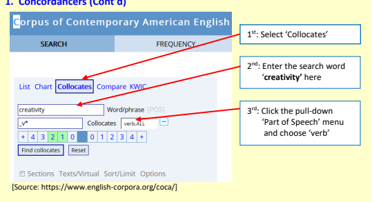

Part 1 Connecting with the Theme

## Activity 1 - Post-Viewing Discussion

1. Is the solution to Hong Kong's housing shortage as simple as building more housing? What potential problems could arise from that?

2. How do you feel about your own living space? When it feels too small, how do you cope with that feeling?

## Logical Argumentation

In Unit 3, you learned that arguments must be persuasive to be effective. One element that contributes to the persuasiveness of your argument is the quality and extent of the evidential support you provide. 

Another arguably equally important factor to consider is the logic and reasoning of your argument. Is your argument realistic and feasible? Does it 'make sense' to the reader? The answers to these questions may seem obvious, but often times it is difficult for the writer to notice his/her own flaws in the logic of an argument. 

## █║ Logical Fallacies

Logical fallacies represent (often) deliberate flaws in reasoning which make an argument appear more convincing on the surface, but actually undermine the quality of the argument. 

## Activity 2 - Video-Watching

Watch the YouTube **video on logical fallacies:** https://www.youtube.com/watch?v=tX4stUoyf9Y
Answer the questions below while watching.

1. Logical fallacies are errors in __________________ that weaken the ____________ of an argument.

2. What is circular reasoning?

 3. What example is given to illustrate a slippery slope argument?

4. What explanation is given to illustrate the logical flaw in the driver's answer?

# Part 2 Academic Reading

## Reading Skill Evaluating Arguments: Logical Fallacies

As a critical reader, it is important to be able to evaluate whether an argument is sound and valid. Sometimes, there may be a fallacy, or an error, in an argument due to the writers' own bias. At other times, writers may intentionally produce fallacious arguments to predispose readers to agree with their viewpoint. Some common types of logical fallacies are presented below. 

Fallacy of presumption: The writer includes a premise (part of the argument which is already assumed to be true) that does not actually have an established factual basis in reality.

Example: Hongkonger Tsang Shiu-tung, 51, says he sees "no light at the end of the tunnel", 
having been in the queue for public rental housing for 16 years. As of March this year, there were about 147,500 general applications for public rental housing from families and single elderly people who had priority, with an average waiting time of 6.1 years.

Further back in the queue were about 97,700 non-elderly single applicants, many of whom have been waiting for decades.

Sun, F. (2022, June 8). Creating value from 'forgotten spaces' in Hong Kong's unique urban ecosystem. 

SCMP. https://multimedia-scmp-com.lib-ezproxy.hkbu.edu.hk/news/hongkong/article/3180749/subdivided-units-part1/index.html What should be the waiting time? How do we know whether 6.1 years is a relatively long or short period of time? What is the basis for making this determination? There is an implied presumption here regarding an appropriate waiting time. 

Appeal to emotion: Writers seek to manipulate an emotional response rather than formulate a strong argument.

Example: After a long night shift, security guard Leung returns to the tiny space he calls home in an old residential building in Sham Shui Po.

Sun, F. (2022, June 9). 'Like a caged animal': Why Hongkongers in city's notorious subdivided flats say they have no choice. *SCMP*. https://multimedia-scmp-com.libezproxy.hkbu.edu.hk/news/hong-kong/article/3180749/subdivided-units-part1/index.html The deliberate insertion of the words "long", "tiny", "calls home", and "old" are all designed to elicit sympathy from readers rather than merely convey a factual account of the event.

False cause/Correlation does not imply causation: Two events occurring together does not mean they are causally connected.

Example: The Kwai Chung Subdivided Flat Residents Alliance, made up of residents living in such units in Kwai Chung and social workers, found in a survey last year that about three in four of 78 people living in inadequate housing units suffered moderate to severe depression, and more than two in five had moderate to severe anxiety.

Sun, F. (2022, June 9). 'This is not a home': Depression, cockroaches, rats and shame add up to misery 

for Hongkongers in subdivided flats. *SCMP*. https://multimedia-scmp-com.libezproxy.hkbu.edu.hk/news/hong-kong/article/3180896/subdivided-units-part2/index.html Are there other confounding variables or factors which could contribute to their depression or anxiety? Has clear causality been established between the place of residence and the psychological issues observed?

False equivalence (the 'apples and oranges fallacy'): The writer attempts to draw an analogy in support of an argument by comparing two seemingly similar things.

Example: Some of the city's poorest residents are living like prisoners. A 2017 survey by the Kwai Chung Subdivided Flat Residents Alliance found the average living space per person was only 50 sq. ft - roughly the size of three toilet cubicles or half the size of a standard parking space. Prisoners in shared dormitories have an average space of 49.5 sq. ft per person, while maximum security prisoners typically get 75 sq. ft of living space.
Arranz, A., Duhalde, M., Lee, K., Huang, H., & Wong, D. (2022, June 7). Life in Hong Kong's shoebox housing. *SCMP*. https://multimedia.scmp.com/infographics/news/hongkong/article/3180601/subdivided-flats/index.html Is it logical to assume that the poorest residents should have more living space than prisoners? Is it perhaps because prisoners are "bad" and poor people are "good"? 

Non sequitur: From the latin meaning "does not follow". This fallacy features an argument for which the conclusion does not follow from the premise on which it is based.

Example: These so-called nano flats - about 260 sq. ft in size - are branded as an affordable option even though they typically sell for millions. 

Arranz, A., Duhalde, M., Lee, K., Huang, H., & Wong, D. (2022, June 7). Life in Hong Kong's shoebox housing. *SCMP*. https://multimedia.scmp.com/infographics/news/hongkong/article/3180601/subdivided-flats/index.html The conclusion that they should not be branded as affordable because they typically sell for millions is an unreasonable conclusion (it "does not follow" *that* homes should not be branded as affordable from the premise that they sell for millions). Most home buyers in Hong Kong spend millions to buy their *home,* 
making these homes, by definition, *'affordable'.*
Cherry picking fallacy: Cherry picking refers to highlighting evidence which supports one's own position, while simultaneously disregarding or downplaying evidence which runs counter to that position.

Example: On her salary of HK$10,000 a month, this is all she can afford, even as rents have crept up and her living space has shrunk. She started out paying HK$2,000 a month for a 200 sq. ft unit, but now pays HK$4,200 for less than 100 sq. ft in Sham Shui Po. 

Sun, F. (2022, June 10). Can Hong Kong deliver on 2049 target to wipe out subdivided flats and 'cage homes'? Resident says 'I will probably die in one of them'. *SCMP*. https://multimedia-scmpcom.lib-ezproxy.hkbu.edu.hk/news/hong-kong/article/3181013/subdivided-unitspart3/index.html Where was her original residence located where she paid HK$2,000 a month for a 200 sq. ft unit? Was it also located in Sham Shui Po? Might she have lived in a more affordable district and the author chose to omit this piece of information to strengthen the effectiveness of the argument? 

Some of the information presented in this reading skill section is adapted and modified from: Zadina, J. N., Smilkstein, R., & Daiek, D. (2013). College reading: The science and strategies of expert *readers*. Cengage Learning.

For more examples and explanations of logical fallacy, you may refer to the following websites: Purdue Online Writing Lab:
https://owl.purdue.edu/owl/general_writing/academic_writing/logic_in_argumentative_writing/fallacies.html Writing a Paper: Avoiding Logical Fallacies by Walden University:
https://academicguides.waldenu.edu/writingcenter/writingprocess/logicalfallacies

## Activity 3 - Analysing Examples Of Logical Fallacies

In the table below, *describe* the logical fallacies indicated in bold within the extracts of the article. Identify the type of fallacy if you can, but more importantly, discuss and summarise **what is** 
unreasonable or illogical about the statement given the relevant context (i.e., **within this article, in Hong** Kong society, etc.). Discuss your answer with your partner(s). 

Creating value from 'forgotten spaces' in Hong Kong's unique urban ecosystem **by Lau, T. (2022)**

## Extract 1:

We have not focused enough on actually creating more value in our built environment in Hong Kong. We must now look beyond those four walls, and consider a building's context, how it relates to the street, the "spaces in between", and for ways to create new shared value that prioritises people.

1) Take a look at the creation of the High Line in New York, which has unlocked the potential of the once-gritty and industrial Meatpacking District. Its two neighbouring districts, along the entire length of the West Side of Manhattan, are **now one of the world's** most desirable commercial and residential submarkets.

## Extract 2:

In Hong Kong, our density and multidimensional mixed-use urban fabric often result in forgotten pockets of "spaces in-between".

We should consider how building for a better civic experience and creating new mechanisms for district stewardship actually drive more value and resilience in the city. This has the capacity to unlock the true potential in what is already an unparalleled urban ecosystem.

One such area that could potentially benefit from this kind of approach is Duddell Street, a unique oasis in the heart of our historic and primary core business district. The street culminates in Hong Kong's version of the Spanish Steps in Rome, the broad granite steps and gas lamps being a remnant of our built heritage. Though surrounded by some of the most valuable real estate in the world, Duddell Street itself is often forgettable. It has become a goods-loading street where illegal vehicle parking and unsightly ventilation and mechanical systems also eat up its precious street frontage. 2) What if Duddell Street is "pedestrianised" as part of a holistic repositioning and development scheme, with inviting street-facing retail, food and beverage scene, pleasing landscaping, and public seating areas for passive enjoyment?

What if there was local street management to restrict loading hours, enforce parking rules, and implement smart curbs to allow safer sharing with pedestrians? What if the iconic gas lamp steps are activated on a regular basis with weekend film screenings, live performances, and other community uses?

What are the opportunities for civic innovation that bring the best of place-making and place-keeping practices into the heart of Hong Kong? Finally, might there be interesting interconnected spaces along the street that blur the lines between public and private, indoor and outdoor, that can provide new commercial and cultural opportunities?

## Extract 3:

The future of real estate is all about permeability. At a basic human level, places need to be inviting and allow for freedom of movement, both into and out of a building. This does not mean that walls do not exist, rather, we should rethink the barriers, both perceived and real, when it comes to who we allow into our private spaces. Creating new kinds of public spaces in our vertical city should be a priority, as well as truly allowing for public uses in streets and "spaces inbetween."
3) Some of the best performing retail properties in the world function as public space in many ways. For example, Apple stores are truly community hubs for learning, socialising and, of course, consuming Apple products. It no longer refers to its retail outlets as stores, but as "Town Squares".

Why cannot we adopt this approach for our office lobbies? Could Duddell Street become one of the world's greatest streets, where commercial spaces command a premium for its direct access to one of the most inviting public spaces in Hong Kong? Surely that is a vision worth realising.

Lau, T. (2022, May 31). Creating value from 'forgotten spaces' in Hong Kong's unique urban ecosystem. *SCMP*. 

https://www-scmp-com.lib-ezproxy.hkbu.edu.hk/business/article/3179762/creating-value-forgottenspaces-hong-kongs-unique-urban-ecosystem
Statement 1:

- Type(s) of logical fallacy: ______________________________________

 

Statement 2:

 

## Language Skill For Writing Word Collocations And Word Choice

As discussed in the section on 'Using synonyms and antonyms', it is very important that your chosen synonym or antonym fits the context of the idea that you want to paraphrase. To ensure that the paraphrase conveys the meaning of the original idea, and that it does not sound awkward, you have to also think about word choice and word collocations. Collocation ("co-" [shared/together] + "location") refers to the conventional patterns in which words are typically grouped together, such as 'take medicine' or 'turn on the air conditioner'. However, collocation combinations differ across languages, so make sure that the collocation patterns you use are commonly found in academic English. Many Chinese collocation combinations (e.g., 食藥 for 
'take medicine' and 開冷氣機 for 'turn on the air conditioner'), for instance, differ significantly from their English counterparts, and thus it is common to see 'eat medicine' and 'open the air conditioner' in students' writings. To this end, a number of tools can help you improve your word choice.

## 1. Concordancers

A concordancer is a computer software programme that allows you to search and analyse language from a corpus (a large language database). The tool is particularly useful if you want to find out the relationships between words and how a word or phrase is used in everyday speech and writing.

Many free concordancers are now readily available on the internet. Below are two examples:

| Brigham Young University                                                | http://corpus.byu.edu/coca/   |
|-------------------------------------------------------------------------|-------------------------------|
| Corpus of Contemporary American English (COCA) Brigham Young University | http://corpus.byu.edu/bnc/    |
| British National Corpus (BNC)                                           |                               |

Look at the following sentence produced by a student writer:
"Spoon feeding will drive down our creativity."
Question: Does 'creativity' collocate with 'drive down'?

Let us explore how a concordancer can help you find the most appropriate verb that most frequently pairs with 'creativity'. 

Language Skill for Writing Word Collocations and Word Choice

1.  Concordancers (Cont'd)

The concordancer will then present a list of verbs that are used with 'creativity'. The results are ordered

 If you click on a particular result (e.g., item 8 'stifle'), you will see the context in which the verb 'stifle' is used with 'creativity'.

SEARCH
FROUENCY
CONTEXT
ACOUNT

| may educate hundreds of thousands of enzineers, but if it continues to still their creativity, they will never succeed at the high   |                                                                                                                                                |                                                                                                                                          |
|--------------------------------------------------------------------------------------------------------------------------------------|------------------------------------------------------------------------------------------------------------------------------------------------|------------------------------------------------------------------------------------------------------------------------------------------|
| A B C                                                                                                                                |                                                                                                                                                |                                                                                                                                          |
| A B C                                                                                                                                | a weakness. The nation's education system is too test-oriented, schools here stille creativity and parental pressures often deprint            |                                                                                                                                          |
| A 0 0                                                                                                                                | . " 1 Too many rules and guidelines up front may do more to stifle creativity than to convey the knowledge and structure w                     |                                                                                                                                          |
| A B O                                                                                                                                | stress. Science is telling us that stress can dampen your immune system, stille creativity and even shorten your life. So as this hol          |                                                                                                                                          |
| Future of Ideas, Lessig pressed the case that regulatory control was threatening to stifle creativity on the World Wide Web. # On    |                                                                                                                                                |                                                                                                                                          |
| RAJournal                                                                                                                            | AB                                                                                                                                             |                                                                                                                                          |
| AB                                                                                                                                   | on the aspect of a small-scale moveable picture gallery. Copying paintings tended to stille creativity as factory artists developed            |                                                                                                                                          |
| ). Fisher (1995) argues that statewide boards and multicampus systems stiffe campus creativity and innovation, result in unnece      |                                                                                                                                                |                                                                                                                                          |
| A B O                                                                                                                                |                                                                                                                                                |                                                                                                                                          |
| AB                                                                                                                                   | , he says, the test will reinforce formulaic, uninspired writing, and stifle creativity. " This is going to be regurgitation in a different    |                                                                                                                                          |
| the large collaborations will be unwieldy, promote growth of established groups, and stifle creativity. Perhaps of                   |                                                                                                                                                |                                                                                                                                          |
| A B                                                                                                                                  |                                                                                                                                                |                                                                                                                                          |
| suntry(Mng)                                                                                                                          | A B  A                                                                                                                                         | white background. " Some people think that the strict rules of botanical art stifle creativity, but that's not the case at all. " Kate N |
| belleve the " **28;705;TOOLONG **32;735;TOOLONG " stories spun by corporate America in order to stille creativity, off our base      |                                                                                                                                                |                                                                                                                                          |
| OffOurBackS                                                                                                                          | A B C                                                                                                                                          |                                                                                                                                          |
| WashPost                                                                                                                             | A. B. C. so far, China has been a cultural disappointment. Government restrictions continue to stille creativity. " All Chinese writers are bo |                                                                                                                                          |

## 1. Concordancers (Cont'D)

After scanning the result page, you will find that words such as 'stifle', 'encourage', and 'enhance' are far more suitable verb alternatives in the context of the original sentence 'Spoon feeding will drive down our creativity.'

## Original

"Spoon feeding will drive down our creativity." 

## Suggested Sentences

[Using a synonym] Spoon feeding will stifle our creativity. [Using an antonym] Spoon feeding will not enhance / encourage / foster / develop our creativity. 

## 2. Collocations Dictionaries

A good collocations dictionary is another useful tool for improving your word choice. An example of such dictionary is Oxford Collocations Dictionary.

Below is a screenshot showing you words that collocate with 'integrity':

[Source: Online Oxford Collocation Dictionary https://www.freecollocation.com/search?word=integrity] 

## █║ Counterarguments And Refutations

A **counterargument** supports a stance that is deliberately taken in opposition of your own argument, whereas a **refutation** demonstrates why that counterargument is untenable or fallacious. Both counterarguments and refutations serve important roles in enhancing the persuasiveness of an argumentative essay by showing readers your in-depth knowledge of viewpoints which run counter to your own.

## Activity 4 - Analysing Examples Of Counterargument And Refutation

Read and analyse the counterargument and refutation in the following paragraphs. Answer the questions that follow.

Example 1:
Essay topic: 'Urbanisation is a curse.' Do you agree or disagree? 

## The Author'S Stance: Urbanisation Is Not A Curse.

However, some people are convinced that urbanization is actually a curse as it accelerates the effects of greenhouse gasses (GHG). They believe that countless trees have been cut down in the cities for building houses in order to accommodate a great influx of people from the suburban areas, and as a result, GHG 
continue to increase to a level that exacerbates the already dire situation. Although this argument sounds valid at a glance, it does not remain tenable upon closer scrutiny. Urbanization is a blessing as it attracts a lot of talents to work in the cities, which benefits the GDP. The talent will stay in cities where the facilities and economic development are much better than those in rustic areas. With the increased workforce, there will be a growth in GDP, and hence it could be argued that urbanization is actually a blessing, not a curse. Example 2:
Essay topic: Should the Urban Renewal Authority (URA) focus more on the needs of the elderly in their urban planning?

The author's stance: The URA SHOULD focus more on the needs of the elderly in their urban planning The Urban Renewal Authority supporters may argue that research findings indicate that the health of the elderly in redeveloped urban areas has in fact improved. As evidence, they may point to a clear correlation between increased density and improved health in these areas (Kandt et al., 2017). This seems to indicate that the intensity of land use in these locations gives the elderly improved access to different community facilities, along with reduced commute time due to the proximity and variety of available services. The impetus for this change seems echoed by elderly Kwun Tong residents who expressed a preference for "proximity to amenities and the effective use of space" (Yung et al., 2016, p. 9). Undoubtedly, on the surface, such quantitative data presents a compelling case that intensity of land use correlates with improved health, but in reality this correlation likely merely reflects the displacement of the poor elderly population in those gentrified locations by incoming wealthier residents. It would thus stand to reason that displacing the poorer elderly population with a wealthier one would produce better health outcomes. 

Yet, this correlation fails to take socioeconomic factors into consideration. A telling example of this is the MTR's transit-oriented model of development, which creates a highly dense and centralized residential area that primarily benefits wealthier residents (Wang, 2022). This approach clearly ignores the interest of the local socio-economically disadvantaged elderly residents. 

1. Annotate where the counterargument ends and the refutation begins in each example.

2. How do the authors signal this transition (from the counterargument to the refutation) in each example?
Example 1:
Example 2:

3. Is the counterargument and/or refutation persuasive in each example? Why or why not?
Example 1:
Example 2:

## Language Use Transitional Phrases For Presenting Counterarguments And Refutations

Instead of using expressions such as 'However, other people disagree. They think that …' to introduce a counterargument, you are strongly advised to make use of a variety of expressions like the ones listed in the table below.

| Presenting Counterarguments (CA) Expressions Examples It has been argued / claimed /  It has been contended that students should be  contended / asserted that … allowed to use mobile phones during lessons.  Opponents / Some people  Opponents believe that nuclear energy is the way of  believe that … the future.  It is often argued / believed /  It is often argued that the university attendance  suggested that ... policy should be abolished.   |
|---------------------------------------------------------------------------------------------------------------------------------------------------------------------------------------------------------------------------------------------------------------------------------------------------------------------------------------------------------------------------------------------------------------------------------------------------------------|

To introduce the refutation, you can use a number of expressions in addition to connectors such as 
'However'. In each of the expressions below, the subordinate clause (e.g., 'Although taking online classes can be convenient,') summarises the counterargument and acknowledges its validity to some extent, while the main clause introduces the refutation (e.g., 'it is difficult for many students to stay on task.') 

| Presenting Refutations (R) Expressions                                                                     | Examples                                                                                                                               |
|------------------------------------------------------------------------------------------------------------|----------------------------------------------------------------------------------------------------------------------------------------|
| Although / Even though (opponents believe that) + [CA],  [R].                                              | Although taking online classes can be convenient  [CA], it is difficult for many students to stay on task  [R].                        |
| While / Despite (the fact that) /  In spite of (the fact that) + [CA],  it is argued that + [R]  because … | While changing jobs can be difficult and stressful [CA],  it is argued that a new job may provide greater  opportunities because … [R] |
| One may argue that + [CA], but                                                                             | One may argue that mercy killing reduces the pain of                                                                                   |
| [R].                                                                                                       | terminally-ill patients [CA], but it may result in  possible abuse and the violation of human dignity [R].                             |

## Note!

In University English I, both **the counterargument and refutation in your argumentative essay** should be supported by evidence.

## █║ Hedging And Boosting

'Hedging' and 'boosting' represent two opposite forms of evaluative language with which you can manipulate the degree of certainty expressed through the tone of your writing. 'Hedging' is used to create a more cautious tone and thus reduce the degree of certainty, while 'boosting' is used to emphasise or strengthen points. These two complementary rhetorical strategies are often used in constructing the counterargument and the refutation.

## Language Use Hedging And Boosting

When **presenting counterarguments**, you are advised to express them in a tentative manner so that you will leave little room for attack by critical readers (especially if your interpretation of the facts turns out to be wrong later). This use of tentative or **cautious** language is called **hedging**.

| Hedging Language                                                                 | Examples                                                                                       |
|----------------------------------------------------------------------------------|------------------------------------------------------------------------------------------------|
| Modal auxiliary verbs                                                            | Speaking more than one language could make you                                                 |
| e.g., can, could, may, might, would                                              | more competitive in the job market.                                                            |
| Words expressing tentativeness e.g., appear, seem, tend to / a tendency, look    | There is a tendency for children whose parents are  smokers to start smoking as an adolescent. |
| Words indicating probability e.g., likely, probably, perhaps, possibly, possible | It is very likely that vegetarians live a healthier  lifestyle.                                |
| Frequency adverbs e.g., usually, generally, often, occasionally                  | It is generally believed that vegetarians live a  healthier lifestyle.                         |

Conversely, **boosters** serve to establish a more subjective tone conveying a relatively higher degree of confidence and conviction, which can strengthen the persuasiveness of your argument. 

| Boosting Language                                                            | Examples                                                                                                          |
|------------------------------------------------------------------------------|-------------------------------------------------------------------------------------------------------------------|
| Intensifiers e.g., rather, quite, considerably, undoubtedly                  | It is rather difficult to improve the housing  situation in the current political climate.                        |
| Negating boosters                                                            | There is little that can be accomplished if everyone                                                              |
| e.g., few, little                                                            | is pursuing their own agenda.                                                                                     |
| Other phrases and structures e.g., for certain, It seems clear/apparent that | *It seems readily apparent that the focus is placed on profits and progress, as opposed to people and principles. |
| Strong reporting verbs                                                       | This is clearly evidenced by the recent decision to                                                               |
| e.g., evidenced by, proves, highlights                                       | gentrify the district rather than merely renewing it.                                                             |

* note that hedging and boosting strategies can be employed together to create an even more specific degree of certainty It may also be helpful to frame hedging and boosting within the system of **modality**. Modality conveys the writer's or speaker's attitude toward the proposition being expressed generally in two major dimensions, namely **epistemic** and **deontic** modality. You can conceptualize the differences in degrees within these dimensions as different locations on a scale according to the degree of certainty or obligation they express: Epistemic (possibility/prediction/ability/etc.) -

## Activity 5 - Analysing The Use Of Hedges And Boosters In A Counterargument And Refutation

Identify all the hedges and boosters in the following counterargument and refutation **paragraphs.** 
Discuss how they enhance the persuasiveness of the author's stance.

Essay topic: *Should the Urban Renewal Authority (URA) focus more on the needs of the* elderly in their urban planning? Urban Renewal Authority supporters may argue that research findings indicate that the health of the elderly in redeveloped urban areas has in fact improved. As evidence, they may point to a clear correlation between increased density and improved health in these areas (Kandt et al., 2017). This seems to indicate that the intensity of land use in these locations gives the elderly improved access to different community facilities, along with reduced commute time due to the proximity and variety of available services. The impetus for this change seems echoed by elderly Kwun Tong residents who expressed a preference for "proximity to amenities and the effective use of space" (Yung et al., 2016, p. 9). Undoubtedly, on the surface, such quantitative data presents a compelling case that intensity of land use correlates with improved health, but in reality this correlation likely merely reflects the displacement of the poor elderly population in those gentrified locations by incoming wealthier residents. It would thus stand to reason that displacing the poorer elderly population with a wealthier one would produce better health outcomes. Yet, this correlation fails to take socioeconomic factors into consideration. A telling example of this is the MTR's transit-oriented model of development, which creates a highly dense and centralised residential area that primarily benefits wealthier residents (Wang, 2022). This approach clearly ignores the interest of the local socio-economically disadvantaged elderly residents.

## Essay Topic: Gentrification Is A Crucial Component Of Urban Development And Revitalization Efforts In Hong Kong.

Some may argue that *gentrification in Hong Kong can bring in new businesses and amenities that benefit the entire community. They may point as evidence to the Kwun Tong Town Centre Project 
(KTTCP), for example, which involves introducing an 8,700 square meters of green space, 40% increase in space for medical services, and a commercial center connected to public transport (La Grange & Pretorius, 2016). This reallocation of space can potentially offer diverse benefits to meet the needs of different residents, whether someone is in need of better medical service or simply wants to go for a relaxing stroll in the park. While it is true that gentrification can bring in new businesses and amenities, this is more often than not a zero-sum game in which preexisting businesses do not benefit. In fact, as noted by Qian and Yin (2018), other than directly forcing the displacement of family-operated businesses, the infusion of new businesses also indirectly disrupts the existing interaction within the neighborhood network. Instead of relying on gentrification to bring in new businesses and amenities, urban development and revitalization efforts should prioritize community-based economic development that benefits all residents and community groups, not just a select few.

*Gentrification is the process of improving and renovating a neighborhood, resulting in an influx of wealthier residents and higher property values, which can displace lower-income residents who can no longer afford to live in the area.

## Activity 6 - Practice Writing A Counterargument And A Refutation

Work in pairs. Write a body paragraph (around 180 words in length) presenting the counterargument and refutation in response to the topic of "Does *gentrification significantly disrupt the local ecosystems* in *older districts in Hong Kong*?" Remember to cite **evidence from the two extracts below to support** 
your counterargument and refutation.

- **Stance:** Gentrification significantly disrupt the local ecosystems in older districts in Hong Kong - **Counterargument:** Gentrification can occur with minimal disruptions to local ecosystems in Hong Kong's dilapidated older districts.

- **Refutation:** Gentrification in Hong Kong's older districts significantly disrupts the lifestyles of certain demographic groups.

## Extract 1 (Evidence For The Counterargument):

Hong Kong's quite spectacular economic development, rising real incomes and social and cultural impacts of globalization have led to rising community aspirations for a quality living environment. Yet, much older inner-city housing stock is rundown and functionally problematic although located in vibrant and highly sought-after inner-city areas. Thus, one important consequence of Hong Kong's urban density with regard to gentrification is that the city has not renewed its inner-city housing stock on a scale that disrupts economic and cultural development. Consequently, the inner city has remained accessible to lower-income families living in poor quality but affordable and very well-located housing; and many of these households have aged in place and have strong social networks developed, in many cases, over decades. Monkkonen and Zhang (2011) observe that while Hong Kong's income inequalities increased between 1991 and 2006, segregation levels did not. The inner city is more diverse at a large scale although more segregated at a small scale, reflecting the construction of large-scale (often gated) housing estates targeted to different socio-economic groups. Simply put, in the inner-city areas in particular, the rich and poor live in close proximity.

Adapted from:
La Grange, A., & Pretorius, F. (2016). State-led gentrification in Hong Kong. *Urban Studies, 53*(3), 506523.

## Extract 2 (Evidence For The Refutation): 5.3.2 Reshaping Neighborhood Morphology

Historically, Yuet Wah Street is a traditional settlement for Hakka and Teochew immigrants (Chao-Shan area, east of Guangdong Province, mainland China). The neighborhood has formed special kaifong associations based on Chao-Shan culture and traditions, such as Obon festival, pigeon racing and Teochew music that have been an indispensable part of their daily life. And family-operated businesses around Yuet Wah Street are largely supported by acquaintances. Hence, kaifong associations and commercial activities have come into being a neighborhood network and interaction among these inhabitants for a long time. However, through in-depth interview with the former managing board of Urban Renewal Authority, the cultural preservation strategy only targets on those traditional cultures accredited by authorities, while those minor cultures and informal traditions are likely to be demolished in the process of redevelopment. 

Before redevelopment, family-operated businesses and hawkers were main commercial activities that preserve a relatively low level of living costs; and lower rental expenses dependent on old apartment buildings also supported affordable accommodation for low-income groups in Yuet Wah Street (Li, 2007). After redevelopment, relocation associated with displacement of inhabitants will break this kind of neighborhood interaction to a large extent. Figure 7 presents places of relocation or rehousing for those home owners originally living in redeveloping area. 46% of property owners (including shopkeepers) will be relocated in Kwun Tong and Kowloon east areas and other 54% will be relocated somewhere far away from their original neighborhoods.

Adapted from:
Qian, X., & Yin, C. (2018). From redevelopment to gentrification in Hong Kong: A case study of Kwun Tong town center project. *Open House International*, 43(3), 83-93.

Remember to use appropriate expressions to signal the transition between the counterargument and the refutation, as well as ensure that the sentences follow a logical, PEEL-based flow.

## █║ Writing The Conclusion

The concluding paragraph pulls all the main arguments of the essay together and demonstrates that you have proven your point. The conclusion of an argumentative essay should perform three core functions:

## 1) Restating Your Thesis Statement:

This restatement of the thesis is important because it makes the whole essay solid and complete. When restating the thesis, make sure you paraphrase **the key supporting reasons**.

## 2) Summarising Your Arguments:

To establish a sense of closure and convince your readers that your essay has covered all the most important arguments about the issue, a condensed review of the main arguments should be given.

3) Making a final commentary:
Provide a brief message about a desirable future direction to be taken or offer a central message for readers.

## Activity 7 - Analysing Examples Of Conclusion

Compare two examples of conclusions. Discuss the questions that follow. Essay topic: Does gentrification bring benefits to the entire community?

## Example 1:

In conclusion, gentrification in Hong Kong is simply a natural process of urban development that benefits everyone involved. It may cause some short-term displacement or inconvenience, but the long-term benefits to the community far outweigh any temporary setbacks. Those who oppose gentrification are simply resistant to change and progress. With the right policies and regulations in place, the growth and revitalization of Hong Kong can continue for the benefit of all.

## Example 2:

In conclusion, the question of whether gentrification brings benefits to the entire community is a complex and nuanced issue. While it is true that gentrification can bring about positive changes such as increased economic opportunities and improved public services, it is important to recognize that the negative consequences to the entire society, particularly for marginalized communities who may be displaced or excluded from the benefits of gentrification, outweigh the benefits. Therefore, policymakers and community leaders should take a balanced and inclusive approach to urban development that prioritizes the needs and voices of all community members. By doing so, more equitable and sustainable communities that benefit everyone, rather than just a privileged few can be promoted.

1. Which example shows a more effective conclusion of an argumentative essay? Why? 2. What do you notice about the language features (e.g., tense, voice, word choice) in example 2?
# █║ Writing An Argumentative Essay: A Review

## █║ Structure Of An Argumentative Essay

In University English I, you need to write about 800 words (+/- 10%) for the argumentative essay assignment by adopting a **five-paragraph** approach.

Clearly state your **position** and the **three reasons**supporting your stance in the **thesis statement.**
Length: approximately 100-120 words Three Body Paragraphs

Two of the paragraphs: **One supporting reason** justified by evidence and explanation/elaboration in **each** paragraph One of the paragraphs: **A counterargument** and **a refutation** (each also justified by evidence and explanation/elaboration)

Length of each paragraph: approximately 180-200 words Conclusion

Restate your **thesis statement** and **summarise** the **three** supporting reasonsin the conclusion. Make a **final commentary**.

Length: approximately 80-100 words R**eference List**

You need to list the **full reference** information of the source material(s) in the APA style. 

# An Example Of An Argumentative Essay

## Should The Urban Renewal Authority (Ura) Focus More On The Needs Of The Elderly In Their Urban Planning?

Hong Kong houses a number of old historical districts and buildings which are home to many older residents of the region, but these areas have become dilapidated to varying degrees. The Hong Kong Urban Renewal Authority (URA) has therefore been given the unenviable task of handling regeneration and redevelopment efforts within these decaying districts, such as Kwun Tong and To Kwa Wan. There is concern, however, that the needs of the elderly may be overlooked during this process due to the gentrification it entails (Kandt et al., 2017; Wang et al., 2022). This essay thus argues that the URA should more carefully account for the elderly's space for socialising, access to community facilities, and socioeconomic differences in their renewal efforts to avoid further disenfranchisement of this precious demographic. Ample space within their local community in these old districts is crucial for the elderly to maintain a healthy social life. According to elderly residents of Sham Shui Po and Kwun Tong, social ties are established and maintained through the ability to navigate and socialize within a healthy environment 
(Yung et al., 2016). These social networks can provide a sense of familiarity and stability in the lives of these older residents. Furthermore, given their relatively limited mobility, the elderly in Hong Kong must rely on the availability of parks and open areas in their immediate vicinity all the more. Unfortunately, this may conflict with redevelopment guidelines emphasizing efficient use of space and population density. The impact of this approach on the elderly can be seen in Kwun Tong, where the URA's redevelopment efforts have in fact increased spatial inequity by reducing older citizens' access to community facilities (Wang et al., 2022). This lack of access simply further marginalizes these elderly residents and creates an additional disruption to their social lives. 

Indeed, access to communal amenities is important for the elderly for several reasons. Centrality, which refers to the proximity of available services (Kandt et al., 2017), is one factor which can shed some light on the inadequate attention the URA has paid to the community access needs of the elderly in certain districts. Older residents rely on their district to meet all of their needs, whether it be dining, shopping, or socialising. Specifically, Wang et al. (2022) identify five categories of community facilities on which the elderly rely, noting that the lack of sufficient access for the elderly to cultural centers and community halls is a particularly salient need. These services ideally should be available in a vicinity which is feasible for the elderly to navigate on a daily basis to meet their needs. It is thus clear that both the centrality and accessibility play an important role in maintaining a positive state of mind among the elderly. 

URA supporters may argue that research findings indicate that the health of the elderly in redeveloped urban areas has in fact improved. As evidence, they may point to a clear correlation between increased density and improved health in these areas (Kandt et al., 2017). This seems to indicate that the intensity of land use in these locations gives the elderly improved access to different community facilities, along with reduced commute time due to the proximity and variety of available services. The impetus for this change seems echoed by elderly Kwun Tong residents who expressed a preference for "proximity to amenities and the effective use of space" (Yung et al., 2016, p. 9). Undoubtedly, on the surface, such quantitative data presents a compelling case that intensity of land use correlates with improved health, but in reality this correlation likely merely reflects the displacement of the poor elderly population in those gentrified locations by incoming wealthier residents. It would thus stand to reason that displacing the poorer elderly population with a wealthier one would produce better health outcomes. Yet, this correlation fails to take socioeconomic factors into consideration. A telling example of this is the MTR's transit-oriented model of development, which creates a highly dense and centralised residential area that primarily benefits wealthier residents (Wang, 2022). This approach clearly ignores the interest of the local socio-economically disadvantaged elderly residents.

Admittedly, there are multiple factors for the URA to consider in their renewal efforts, and they cannot solely focus on the elderly. It is shortsighted, however, to prioritize gentrification to the extent that the spatial, social, and economic needs of these older residents are eventually disregarded entirely because ignoring the elderly's needs could result in significant and long-lasting costs to Hong Kong society as a whole. It is essential that policy makers consider these costs when making future decisions regarding urban planning. (765 words)
References Kandt, J., Chang, S. S., Yip, P., & Burdett, R. (2017). The spatial pattern of premature mortality in Hong Kong: How does it relate to public housing? *Urban Studies, 54*(5), 1211-1234.

Wang, S., Yung, E. H. K., Yu, Y., & Tsou, J. Y. (2022). Right to the city and community facility planning for elderly: The case of urban renewal district in Hong Kong. Land Use Policy, 114, 105978.

Yung, E. H., Conejos, S., & Chan, E. H. (2016). Public open spaces planning for the elderly: The case of dense urban renewal districts in Hong Kong. *Land Use Policy, 59*, 1-11.

## Argumentative Essay Editing Checklist

| Editing Checklist                                                                                                                                                                                                                                                                                                                                                                                                                                                                                                                                                                                                                                                                                                                                                                                                                                                                                                                                                                                                                                                                                                                                                                                                    | Yes   | No   | Comments   |
|----------------------------------------------------------------------------------------------------------------------------------------------------------------------------------------------------------------------------------------------------------------------------------------------------------------------------------------------------------------------------------------------------------------------------------------------------------------------------------------------------------------------------------------------------------------------------------------------------------------------------------------------------------------------------------------------------------------------------------------------------------------------------------------------------------------------------------------------------------------------------------------------------------------------------------------------------------------------------------------------------------------------------------------------------------------------------------------------------------------------------------------------------------------------------------------------------------------------|-------|------|------------|
| A) Content A1) Introduction - Is relevant background information provided to set the context? - Is your position/opinion clearly stated in the introduction? - Does the thesis include the reasons for supporting your opinion? A2) Body paragraphs (Supporting  reasons) - Does each body paragraph start with a clear topic sentence stating the main idea of the paragraph? - Is each reason supported by evidence? - Is the evidence sufficiently elaborated? - Are there any unnecessary/repetitive supporting details? A3) Body paragraphs (CA-R)  - Is there a counterargument, and is it supported by evidence and elaboration? - Is there a refutation, and is it supported by evidence and elaboration? A4) Conclusion - Is the thesis restated and paraphrased in the conclusion? - Are the key supporting reasons summarised in the conclusion? - Is a final commentary on the topic provided? A5) Referencing  - Are proper in-text citation techniques used when incorporating evidence from sources? - Is a full list of references/sources used included after the essay featuring proper end-text format? Organisation (Cohesion & Coherence) - Are the supporting reasons connected to the thesis? |       |      |            |

| - Are the supporting reasons and evidence in each body paragraph related? - Does the refutation address the issue raised in the counterargument? - On the whole, do all the ideas flow smoothly (at the paragraph and essay levels)? Language (Grammar & Vocabulary) - Is word choice appropriate? Is sufficient paraphrasing used to avoid repetition of vocabulary? - Does the paraphrase retain the meaning of the original idea in the sources? - Are reporting verbs used appropriately? - Is tense used correctly? - Is there a variety of sentence structures?   |
|-------------------------------------------------------------------------------------------------------------------------------------------------------------------------------------------------------------------------------------------------------------------------------------------------------------------------------------------------------------------------------------------------------------------------------------------------------------------------------------------------------------------------------------------------------------------------|

# Unit 4 Self-Access Learning Resources

## Introduction And Conclusion Writing

This website provides detailed guidelines for writing an introduction and a conclusion in academic papers: https://writingcenter.uagc.edu/introductionsconclusions

## Writing A Counterargument And A Refutation

This website explicates how to write counterarguments and refutations using examples: https://www.englishcurrent.com/writing/argumentative-essayscounterargument-refutation/
This website provides supplemental examples and reminders for creating effective counterarguments and refutations:
https://wisc.pb.unizin.org/esl117/chapter/counterargument-and-refutationdevelopment/

## Hedging And Boosting

This website provides a detailed video about hedging and boosting in academic writing, as well as some practice tasks:
https://www.griffith.edu.au/international/englishhelp/hedging-and-boosting

## Proofreading, Editing And Revising

This website provides different protocols for revising, proofreading, and finetuning your essay before submission: https://caw.ceu.edu/revising-editing